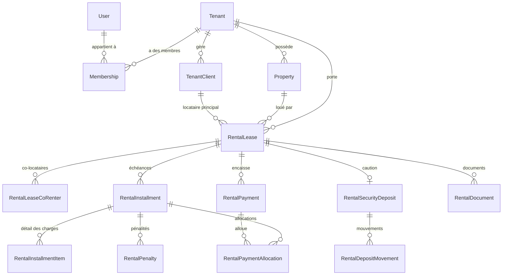

# Modèle de données — ImmoTopia

Ce document décrit le schéma Prisma tel qu'il est aujourd'hui, sans recopier
la liste des champs. Pour les colonnes exactes, ouvrir
`packages/api/prisma/schema.prisma`.

`docs/architecture/database-schema.md` est **partiel et daté**
(2025-01-27, écrit pour 38 des 192 modèles actuels d'après
[docs/README.md](../README.md)). Ne pas s'y fier pour un travail en cours :
`schema.prisma` est la seule référence à jour.

## Compte exact (2026-09-27)

Compté avec :

```bash
grep -c "^model " packages/api/prisma/schema.prisma   # 192
grep -c "^enum "  packages/api/prisma/schema.prisma   # 162
wc -l packages/api/prisma/schema.prisma               # 7571 lignes
```

- **192 modèles**
- **162 enums**

## Modèles par domaine

Regroupement fonctionnel (un modèle n'apparaît qu'une fois, dans son domaine
principal ; certains domaines se recoupent — par exemple `Property` sert à la
fois au CRM et à la gestion locative).

| Domaine                              | Modèles principaux                                                                                                                                                                                                                                                                                                                                                                                                                                                                                                                                                                                                   | Rôle                                                                                                                                                                                                                                                                                                                                                                                                                                                                   |
| ------------------------------------ | -------------------------------------------------------------------------------------------------------------------------------------------------------------------------------------------------------------------------------------------------------------------------------------------------------------------------------------------------------------------------------------------------------------------------------------------------------------------------------------------------------------------------------------------------------------------------------------------------------------------- | ---------------------------------------------------------------------------------------------------------------------------------------------------------------------------------------------------------------------------------------------------------------------------------------------------------------------------------------------------------------------------------------------------------------------------------------------------------------------- |
| Plateforme / agences                 | `Tenant`, `TenantModule`, `Invitation`                                                                                                                                                                                                                                                                                                                                                                                                                                                                                                                                                                               | L'agence elle-même, ses modules activés, ses invitations.                                                                                                                                                                                                                                                                                                                                                                                                              |
| Abonnements & facturation par packs  | `Subscription`, `SubscriptionItem`, `Invoice`, `InvoiceLine`, `PlatformInvoiceSequence`, `PlatformInvoicePayment`, `PlatformPaymentCheckout`, `CatalogItem`, `CatalogCapacity`, `CapacityOverride`, `LotActivation`, `UsageSnapshot`, `QuotaAlert`, `SubscriptionExtensionRequest`                                                                                                                                                                                                                                                                                                                                   | Packs commerciaux, réserve de lots, dépassements facturés, factures émises par la plateforme (voir [PLAN-ABONNEMENTS.md](PLAN-ABONNEMENTS.md)).                                                                                                                                                                                                                                                                                                                        |
| Utilisateurs / RBAC                  | `User`, `RefreshToken`, `PasswordResetToken`, `EmailVerificationToken`, `Membership`, `Role`, `Permission`, `RolePermission`, `UserRole`, `RoleMenuAccess`                                                                                                                                                                                                                                                                                                                                                                                                                                                           | Comptes, sessions, rattachement à une ou plusieurs agences (`Membership`), permissions.                                                                                                                                                                                                                                                                                                                                                                                |
| CRM                                  | `CrmContact`, `CrmContactRole`, `CrmDeal`, `CrmActivity`, `CrmDealProperty`, `CrmTag`, `CrmContactTag`, `CrmContactTargetZone`, `CrmNote`                                                                                                                                                                                                                                                                                                                                                                                                                                                                            | Contacts, opportunités, activités commerciales.                                                                                                                                                                                                                                                                                                                                                                                                                        |
| Biens                                | `Property`, `PropertyTypeTemplate`, `PropertyMedia`, `PropertyDocument`, `PropertyStatusHistory`, `PropertyVisit`, `PropertyVisitCollaborator`, `PropertyMandate`, `PropertyQualityScore`, `PropertyOwnershipShare`                                                                                                                                                                                                                                                                                                                                                                                                  | Fiches de biens, médias, mandats, visites, indivision.                                                                                                                                                                                                                                                                                                                                                                                                                 |
| Géographie                           | `Country`, `Region`, `Commune`                                                                                                                                                                                                                                                                                                                                                                                                                                                                                                                                                                                       | Référentiel hiérarchique public, partagé entre agences.                                                                                                                                                                                                                                                                                                                                                                                                                |
| Gestion locative                     | `TenantClient`, `RentalLease`, `RentalLeaseCoRenter`, `RentalInstallment`, `RentalInstallmentItem`, `RentalPayment`, `RentalPaymentAllocation`, `RentalRefund`, `RentalPenaltyRule`, `RentalPenalty`, `RentalSecurityDeposit`, `RentalDepositMovement`, `RentalDocument`, `DocumentTemplate`, `DocumentCounter`, `RentalPaymentDeclaration`, `LeaseEvent`, `LeaseInspection`, `LeaseInspectionPhoto`, `LeaseManagementTerms`, `RentBillingRun`                                                                                                                                                                       | Cycle de vie du bail : échéances, paiements, pénalités, caution, états des lieux.                                                                                                                                                                                                                                                                                                                                                                                      |
| Paiement en ligne                    | `PaymentGatewayConfig`, `OnlinePaymentCheckout`                                                                                                                                                                                                                                                                                                                                                                                                                                                                                                                                                                      | Configuration et sessions de paiement PaySecureHub par agence (lot 7). `secureLinkId` rattache un checkout au lien de paiement qui l'a créé (lot C5).                                                                                                                                                                                                                                                                                                                  |
| Finance / comptabilité générale      | `ChartOfAccount`, `AccountingJournal`, `JournalEntry`, `JournalEntryLine`, `OwnerAccount`, `OwnerAccountTransaction`, `AgencyFinanceSettings`, `ThirdPartyAccount`, `ThirdPartyMovement`, `VoidDocument`                                                                                                                                                                                                                                                                                                                                                                                                             | Plan comptable, écritures, comptes tiers/propriétaires, annulation de documents.                                                                                                                                                                                                                                                                                                                                                                                       |
| Propriétaires & honoraires           | `OwnerManagementTerms`, `ManagementFee`, `AgentCommissionRate`, `OwnerStatement`, `OwnerStatementItem`, `OwnerPayout`                                                                                                                                                                                                                                                                                                                                                                                                                                                                                                | Conditions de gestion, honoraires, relevés et reversements aux propriétaires.                                                                                                                                                                                                                                                                                                                                                                                          |
| Patrimoine                           | `Asset`, `AssetValuation`, `PropertyLoan`, `PropertyExpense`, `WorkProgram`, `PatrimonyDocument`, `PatrimonyCashPlanSettings`                                                                                                                                                                                                                                                                                                                                                                                                                                                                                        | Valorisation d'actifs, emprunts, travaux liés à un bien détenu ; plan de trésorerie prévisionnel : `PropertyExpense.recurrence` / `recurrenceEndDate` (enum `ExpenseRecurrence`) et date d'exigibilité de la taxe foncière par agence (`PatrimonyCashPlanSettings`, un enregistrement par agence, deux champs nuls = non renseignée, contrainte CHECK : les deux nuls ou les deux renseignés) ; `Asset` est la racine multi-classes (ADR-005 patrimoine multi-actifs). |
| Trésorerie & caisse                  | `CashSession`, `TreasuryAccount`, `TreasuryTransfer`, `RentWithholding`, `TaxRemittance`                                                                                                                                                                                                                                                                                                                                                                                                                                                                                                                             | Sessions de caisse d'agence, comptes de trésorerie, retenues et reversements fiscaux.                                                                                                                                                                                                                                                                                                                                                                                  |
| Syndic / copropriété                 | `Syndicate`, `SyndicateLot`, `LotTenantAssignment`, `LotOwnerProfile`, `LotTenantProfile`, `SyndicateMaintenanceLink`, `SyndicateContractLink`, `ChargeCall`, `ChargeCallBatch`, `ChargePayment`, `GeneralMeeting`, `GMAgendaItem`, `GMResolution`, `GMVote`, `GMProxy`, `ServiceProvider`, `MaintenanceContract`, `CommonAreaAsset`, `SyndicateDocument`, `SyndicateFund`, `SyndicPaymentMethod`, `PaymentReminder`, `LatePaymentPenalty`, `PaymentSchedule`, `PaymentScheduleInstalment`, `ReminderConfig`, `SyndicateBudget`, `BudgetLineItem`, `BudgetAllocation`, `SyndicateIncident`, `IncidentCostImputation` | Assemblées générales, appels de charges, budgets, incidents de copropriété.                                                                                                                                                                                                                                                                                                                                                                                            |
| Chantiers (promotion / construction) | `ConstructionSite`, `CostCategory`, `CostAllocation`, `CashVoucher`, `SiteBudget`, `SiteBudgetLine`, `SiteBudgetAlert`, `BudgetAmendment`, `BudgetAmendmentLine`, `PurchaseOrder`, `PurchaseOrderLine`, `SiteProgressEntry`, `SiteLot`, `LandLease`, `LandLeasePayment`, `LandLeaseAccrual`, `Partnership`, `PartnershipShare`, `PartnershipDistribution`, `Employee`, `SalaryNote`, `SalaryPayment`, `Contractor`, `ContractorContract`, `ProgressStatement`, `ContractorPayment`, `RetentionGuarantee`                                                                                                             | Suivi financier d'un chantier : budgets, avenants, bons de commande, associations, salaires, tâcherons.                                                                                                                                                                                                                                                                                                                                                                |
| Fournisseurs                         | `Supplier`, `SupplierInvoice`, `SupplierInvoiceLine`, `SupplierPayment`, `SupplierPaymentAllocation`                                                                                                                                                                                                                                                                                                                                                                                                                                                                                                                 | Achats et règlements fournisseurs.                                                                                                                                                                                                                                                                                                                                                                                                                                     |
| Stock                                | `StockSettings`, `StockItem`, `StockLocation`, `StockBalance`, `StockMovement`, `StockCount`, `StockCountLine`                                                                                                                                                                                                                                                                                                                                                                                                                                                                                                       | Articles, entrepôts, mouvements et inventaires.                                                                                                                                                                                                                                                                                                                                                                                                                        |
| Maintenance                          | `MaintenanceTicket`, `MaintenanceTicketAttachment`, `MaintenanceTicketComment`, `MaintenanceTicketStatusHistory`, `MaintenanceVendor`                                                                                                                                                                                                                                                                                                                                                                                                                                                                                | Tickets d'incident locatif et prestataires.                                                                                                                                                                                                                                                                                                                                                                                                                            |
| Ventes immobilières                  | `SaleMandate`, `SaleOffer`, `SaleAgreement`, `SaleAgreementCondition`, `SalePaymentMilestone`, `SaleCommission`, `SaleCommissionPayment`                                                                                                                                                                                                                                                                                                                                                                                                                                                                             | Mandats de vente, offres, compromis, commissions.                                                                                                                                                                                                                                                                                                                                                                                                                      |
| Communication                        | `Communication`, `CommunicationPreference`, `EmailNotificationConfig`, `WhatsappNotificationConfig`, `WhatsappGroupInviteLog`                                                                                                                                                                                                                                                                                                                                                                                                                                                                                        | Historique et configuration des canaux e-mail/WhatsApp.                                                                                                                                                                                                                                                                                                                                                                                                                |
| Newsletter                           | `NewsletterList`, `NewsletterSubscriber`, `NewsletterCampaign`, `NewsletterCampaignRecipient`, `NewsletterTemplate`                                                                                                                                                                                                                                                                                                                                                                                                                                                                                                  | Listes de diffusion et campagnes.                                                                                                                                                                                                                                                                                                                                                                                                                                      |
| Documents & audit                    | `AuditLog`, `SavedContactSearch`                                                                                                                                                                                                                                                                                                                                                                                                                                                                                                                                                                                     | Piste d'audit plateforme, recherches sauvegardées.                                                                                                                                                                                                                                                                                                                                                                                                                     |

**Patrimoine — hypothèses de projection.** `PropertyYieldAssumption` (table `property_yield_assumptions`, spec 029) enregistre les hypothèses de projection d'un bien : `years`, `valueGrowthRate`, `rentGrowthRate`, `expenseGrowthRate`, `vacancyRate` (Decimal(7,4), servis en `number`), `tenantId` direct, `updatedByUserId`. Clé unique `propertyId` : une ligne par bien, écrite par upsert, supprimée en cascade avec le bien ou l'agence.

## Patrimoine multi-actifs (lot 1, ADR-005)

Migration `20261004160000_patrimoine_multi_actifs`. Détail :
[specs/023-patrimoine-multi-actifs/data-model.md](../../specs/023-patrimoine-multi-actifs/data-model.md).

- Enums : `AssetClass` (10 classes), `AssetStatus` (`ACTIVE`, `DISPOSED`, `ARCHIVED`),
  `ValuationReliability` (`HIGH`, `MEDIUM`, `LOW`).
- `Asset` (table `assets`, porte `tenantId`) : racine du patrimoine. `propertyId`
  unique et facultatif (FK `Property`, `Restrict`), réservé à `REAL_ESTATE`
  (CHECK `assets_property_only_real_estate_chk`). `details` JSON + `detailsVersion`.
- `AssetValuation`, `PropertyLoan`, `PropertyHolding` : `propertyId` devient
  facultatif, `assetId` facultatif s'ajoute. CHECK SQL : valorisation et part
  détenue = exactement un de (`property_id`, `asset_id`) ; prêt = au plus un
  (aucun = dette personnelle). `PropertyHolding` : unicité `(assetId, entityId)` en
  plus de `(propertyId, entityId)`. Suppression d'un actif : cascade sur ses
  valorisations et parts, `Restrict` sur ses prêts (une dette ne disparaît pas en
  silence). `AssetValuation` gagne `source` et `reliability` (lot 2).
- Lot 2 (spec 024), migration `20261004180000_valorisation_par_classe` :
  `ValuationMethod` passe de 3 à 11 valeurs (`DEPRECIATION_LINEAR`,
  `DEPRECIATION_DECLINING`, `EQUITY_SHARE`, `UNIT_COST`, `BALANCE`,
  `ACCRUED_SAVINGS`, `DISCOUNTED_CLAIM`, `UNIT_VALUE`) et `AssetValuation` gagne
  `reliabilityReasons` (`text[] NOT NULL DEFAULT '{}'`, clés de raison stables ; écrit à la saisie, la lecture
  recalcule la fiabilité effective).
- Lot 3 (spec 025), migration `20261004190000_patrimoine_scenarios` : enum
  `ProjectionScenarioKey` (`PRUDENT`, `CENTRAL`, `OPTIMISTIC`) et `PatrimonyScenario`
  (table `patrimony_scenarios`, porte `tenantId`, FK `Tenant` en `Cascade`) : hypothèses
  (`assumptions`) et opérations de simulation (`operations`) en JSON versionné
  (`schemaVersion`), jamais de résultat de calcul. Unicité `(tenantId, name)`, index
  `(tenantId, updatedAt)` ; CHECK SQL `horizon_years BETWEEN 1 AND 30` et
  `char_length(name) BETWEEN 1 AND 120`.
- `PatrimonyDocument` : `assetId` facultatif (`SetNull`).
- `PropertyExpense`, `WorkProgram`, `OwnerStatement*` : inchangés, rattachés au bien.
- Lot 4A (spec 026), migrations `20261004220000_particulier_enums` (valeurs d'enum, seules dans leur
  transaction) et `20261004220100_particulier_catalogue` (lignes de catalogue) : `TenantType.PARTICULIER`
  (espace personnel), `CapacityKey.ACTIFS` (actifs `Asset` non archivés du tenant) et les packs
  `PARTICULIER_GRATUIT` (0 FCFA, 10 actifs) et `PARTICULIER_PLUS` (2 900 FCFA HT/mois, 100 actifs ; prix et
  plafonds provisoires, modifiables via `updateCatalogItem` sans migration), `tierGroup = PARTICULIER`. Aucune
  table ni colonne nouvelle.
- Lot 4B (spec 026), aucune table : l'unicité « un espace personnel par utilisateur » et le plafond d'actifs du
  palier gratuit tiennent sous concurrence par verrou consultatif de transaction
  (`pg_advisory_xact_lock(hashtext(userId))` à la création d'espace, `hashtext(tenantId)` à la création d'actif),
  pas par contrainte d'unicité.
- Données : un `Asset` `REAL_ESTATE` est créé par bien portant des données
  patrimoniales ou détenu en propre (activation `HELD_PROPERTY` ouverte) ; les
  biens sans tenant sont ignorés ; aucune ligne existante n'est réécrite.
- Le comptage ci-dessus (192 modèles) date du 2026-09-27 ; le schéma en compte
  désormais davantage (`Asset` inclus).

## Motifs transverses

### Scoping par tenant

Le schéma ne porte **pas** un champ `tenantId` uniforme : deux conventions
coexistent, vérifiées par comptage direct sur `schema.prisma` :

- **110 modèles** portent un champ `tenantId` (camelCase, convention
  actuelle).
- **23 modèles plus anciens** portent le champ non mappé `tenant_id`
  (snake_case, nom de champ Prisma identique au nom de colonne).

`utils/tenant-ownership.ts` (`assertBelongsToTenant`) accepte les deux via
son option `tenantField`. `utils/prisma-tenant-guard-extension.ts` dérive la
liste des modèles gardés directement de `Prisma.dmmf` en cherchant l'un ou
l'autre champ — rien à maintenir à la main pour un modèle qui en porte un.

Les modèles qui ne portent ni l'un ni l'autre relèvent de deux catégories,
vérifiées automatiquement par
`packages/api/__tests__/unit/schema-tenant-coverage.test.ts` :

- **ENFANT** : pas de champ d'agence propre, mais un chemin de relation
  obligatoire déclaré dans `CHILD_MODELS` vers un ancêtre cloisonné (exemples
  vérifiés dans le test : `CrmContactTag` → `contact`, `PropertyQualityScore`
  → `property`, `ChargePayment` → `chargeCall` → `syndicate`).
- **GLOBAL** : plateforme, sans notion d'agence, listé et commenté un par un
  dans `GLOBAL_MODELS` — par exemple `User` (un compte peut appartenir à
  plusieurs agences via `Membership`), `Tenant` lui-même, `Role` et
  `Permission` (catalogues), `Country`/`Region`/`Commune` (référentiel
  géographique public), `PropertyTypeTemplate` et `CatalogItem`/
  `CatalogCapacity` (catalogues partagés entre agences).

Un nouveau modèle qui n'entre dans aucune des trois catégories fait échouer
ce test avec un message qui indique quoi faire — c'est le test à faire
passer pour tout nouveau modèle (voir AGENTS.md).

Pour les biens et leurs enfants spécifiquement (médias, documents,
historique de statut — non cloisonnés directement), le chemin obligatoire
passe par `utils/property-tenant-guard.ts`
(`getPropertyForTenant(propertyId, tenantId)`), qui lève `NotFoundError` si
le bien n'existe pas ou appartient à une autre agence — la même erreur dans
les deux cas, pour ne jamais confirmer l'existence d'un bien d'une agence
tierce.

### `RoleMenuAccess` — menus coupés par agence

Table `role_menu_access`. Les rôles (`Role.key`) sont globaux, mais les
décisions de menu sont propres à chaque agence : couper un menu pour
`TENANT_ADMIN` dans l'agence A ne le coupe pas dans l'agence B.

| Champ                              | Sens                                                                                                                                  |
| ---------------------------------- | ------------------------------------------------------------------------------------------------------------------------------------- |
| `tenantId` (nullable, FK `Tenant`) | Agence concernée (`onDelete: Cascade`). **null = périmètre plateforme** (rôles de scope `PLATFORM`, menu du super-admin hors agence). |
| `roleKey`                          | Clé de rôle ou pseudo-rôle de portail (`PORTAL_OWNER`, `PORTAL_RENTER`), sans FK.                                                     |
| `menuKey`, `enabled`               | Clé de menu opaque (catalogue côté web) ; seul `enabled = false` masque.                                                              |

Règles :

- **Aucun héritage** entre null et une agence : une ligne null ne s'applique
  jamais à une agence, et une ligne d'agence jamais à la plateforme.
- Unicité : `@@unique([tenantId, roleKey, menuKey])`, plus un index unique
  partiel SQL `ON role_menu_access(role_key, menu_key) WHERE tenant_id IS NULL`
  (Postgres tient les NULL pour distincts). Prisma ne sait pas exprimer ce
  second index : il vit dans la migration `..._role_menu_access_par_agence`.
- **Une agence créée après la migration part sans aucune coupure** (tous ses
  menus ouverts, sous réserve des défauts déduits des permissions) : c'est
  voulu, une décision prise pour une agence ne doit plus en atteindre une
  autre. Le super-admin règle la nouvelle agence dans « Rôles et
  permissions ».
- Écriture : un rôle `TENANT` ou de portail exige un `tenantId` ; un rôle
  `PLATFORM` l'interdit (`PUT /api/roles/menu-access/:roleKey?tenantId=`).
- `tenantId` est nullable par conception : le modèle est dans `EXEMPT_MODELS`
  de `prisma-tenant-guard-extension.ts`, comme `UserRole` ; les requêtes
  nomment toujours explicitement le périmètre.
- Migration : les lignes existantes des rôles non `PLATFORM` ont été copiées
  pour chaque agence existante (comportement conservé à l'identique), puis les
  lignes null correspondantes supprimées.

### Précision monétaire

Tous les montants sont typés `Decimal` avec une échelle explicite —
**203 déclarations `Decimal` dans le schéma** (compté par `grep -c Decimal`).
Convention observée : `@db.Decimal(12, 2)` ou `@db.Decimal(14, 2)` pour les
montants (loyers, échéances, paiements, factures), `@db.Decimal(5, 2)` pour
les taux/pourcentages, `@db.Decimal(12, 4)` pour certains taux de pénalité.
Jamais de `Float` pour un montant.

### Dates

`DateTime` partout (`created_at`/`createdAt`, `updated_at`/`updatedAt` avec
`@updatedAt`), cohérent avec les deux conventions de nommage de champs
décrites ci-dessus. Les dates métier (échéance, début/fin de bail...)
suivent la même convention que le reste du modèle auquel elles appartiennent.

### Suppression logique

**Aucun champ `deletedAt` dans le schéma** (0 occurrence, vérifié par
`grep -c deletedAt`). Il n'y a donc pas de motif de suppression logique
généralisé : l'archivage/l'annulation passent par un enum de statut dédié
sur chaque modèle concerné (`PropertyStatus.ARCHIVED`,
`RentalLeaseStatus.CANCELED`, `RentalDocumentStatus.VOID`,
`SubscriptionStatus.CANCELED`, etc.), pas par un champ générique. 36 modèles
portent en revanche un booléen `isActive` (référentiels géographiques,
rôles, prestataires...) pour un statut actif/inactif simple.

### Enums d'état importants

- `RentalLeaseStatus` : `DRAFT → ACTIVE → SUSPENDED → ENDED/CANCELED`.
- `RentalInstallmentStatus` : `DRAFT → DUE → PARTIAL → PAID/OVERDUE/CANCELED`.
- `RentalPaymentStatus` : `PENDING → SUCCESS/FAILED/CANCELED/REFUNDED/PARTIALLY_REFUNDED`.
- `ExpenseRecurrence` : `ONE_OFF` (défaut, dépense ponctuelle) / `MONTHLY` / `QUARTERLY` / `ANNUAL` ; `PropertyExpense.paidAt` est la date de la dépense ponctuelle ou la date d'ancrage de la récurrence (occurrences à `paidAt + k × pas`, jusqu'à `recurrenceEndDate`).
- `PropertyStatus` : `DRAFT → UNDER_REVIEW → AVAILABLE → RESERVED/UNDER_OFFER → RENTED/SOLD → ARCHIVED`.
- `SubscriptionStatus` : `TRIALING → ACTIVE → PAST_DUE → CANCELED/SUSPENDED`.
- `LandRegularizationStatus` : `EN_COURS → TERMINEE/ABANDONNEE` (réouverture possible avec motif) ;
  `LandStepStatus` : `A_FAIRE ↔ EN_COURS ↔ BLOQUEE`, `→ TERMINEE` (voir la section
  « LandRegularization »).
- `InvoiceStatus` : `DRAFT → ISSUED → PAID/FAILED/CANCELED/REFUNDED`.
- `TenantStatus` : `PENDING → ACTIVE → SUSPENDED`.
- `MembershipStatus` : `PENDING_INVITE → ACTIVE → DISABLED`.
- `SyndicateStatus`, `MeetingStatus`, `ResolutionResult` : cycle de vie
  d'une assemblée générale de copropriété (voir `docs/README.md` §
  « PR empilées Syndic » pour le contexte récent).

## SecureLink — liens publics à jeton (lot A3, spec 031)

Modèle générique des liens partageables sans compte, ajouté par la spec
[031](../../specs/031-patrimoine-canaux-liens-securises/spec.md) ; le premier usage est
le rapport mensuel d'un propriétaire, le second l'accès des tiers de confiance (lot B3, spec
[034](../../specs/034-patrimoine-acces-tiers-confiance/spec.md), section suivante). Il relève
du domaine « Documents & audit » ; les comptes ci-dessus ne le comptent pas tant que la
migration n'est pas fusionnée. Modèle de menace : [SECURITY.md](../governance/SECURITY.md),
sections « 12 bis. Liens publics à jeton » et « 12 ter. Accès des tiers de confiance ».

| Champ             | Type              | Règle                                                                                                                                                                                      |
| ----------------- | ----------------- | ------------------------------------------------------------------------------------------------------------------------------------------------------------------------------------------ |
| `id`              | `String` (UUID)   | clé primaire (colonne texte, `@default(uuid())`) ; table `secure_links`                                                                                                                    |
| `tenantId`        | `String`          | agence propriétaire du lien, obligatoire ; relation `Tenant`, `onDelete: Cascade`                                                                                                          |
| `scope`           | `SecureLinkScope` | portée du lien ; trois valeurs : `OWNER_MONTHLY_REPORT`, `INSTALLMENT_PAYMENT` (spec 039) et `EXTERNAL_ACCESS_GRANT` (lot B3) ; une route n'accepte que sa propre portée                   |
| `objectType`      | `String`          | nom du modèle visé (`"OwnerStatement"` ; `"ExternalAccessGrant"` pour l'accès d'un tiers de confiance ; `"RentalInstallment"` pour le paiement d'une échéance)                             |
| `objectId`        | `String`          | identifiant de l'objet visé                                                                                                                                                                |
| `tokenHash`       | `String` (unique) | SHA-256 du jeton ; **jamais le jeton**                                                                                                                                                     |
| `expiresAt`       | `DateTime`        | 7 jours par défaut (`SECURE_LINK_DEFAULT_TTL_DAYS`), 30 au plus (`SECURE_LINK_MAX_TTL_DAYS`) ; pour un accès tiers, jamais au-delà de l'échéance de l'accès (`maxExpiresAt` à la création) |
| `revokedAt`       | `DateTime?`       | posé à la révocation ; la ligne est conservée                                                                                                                                              |
| `createdByUserId` | `String?`         | utilisateur créateur ; nul pour un lien créé par le job mensuel ; relation `User` `onDelete: SetNull` ; jamais `include: user`                                                             |
| `viewCount`       | `Int` (défaut 0)  | consultations réussies, incrémenté atomiquement ; **non incrémenté** pour la portée `EXTERNAL_ACCESS_GRANT` (le compteur est sur l'accès)                                                  |
| `lastViewedAt`    | `DateTime?`       | dernière consultation réussie                                                                                                                                                              |
| `createdAt`       | `DateTime`        | création                                                                                                                                                                                   |
| `updatedAt`       | `DateTime`        | `@updatedAt`                                                                                                                                                                               |

**Index** : unique sur `tokenHash` (retrouve la ligne depuis le jeton reçu) ; index sur
`tenantId` ; index sur `(tenantId, objectType, objectId)` (liste des liens d'un relevé) ;
index sur `expiresAt`. Les colonnes sont en snake_case (`tenant_id`, `token_hash`…) ; le champ
Prisma reste en camelCase.

**Règles** :

- **Jeton** : 32 octets aléatoires, base64url, renvoyé **une seule fois** à la création ;
  seul son SHA-256 est stocké. Aucune colonne, aucun journal ni `AuditLog` ne contient le
  clair (ni le hash). Un jeton oublié ne se relit pas : on en crée un autre.
- **Pas de clé étrangère polymorphe** : `objectType` + `objectId` sont des chaînes, sans
  `@relation` vers l'objet visé. Le lien survit donc à l'objet sans contrainte ; la
  vérification relit l'objet par `id` **et** `tenantId` du lien, et refuse (404 uniforme) si
  l'objet a disparu. Ajouter une portée = ajouter une valeur à l'enum et une fonction de
  lecture de l'objet, sans toucher au schéma des modèles visés. La valeur
  `EXTERNAL_ACCESS_GRANT` a été ajoutée par une migration **séparée** de celle des tables du
  lot B3 (`20261007140100_secure_link_scope_external_access`, `ALTER TYPE … ADD VALUE`) :
  PostgreSQL interdit d'employer une valeur d'enum dans la transaction qui l'ajoute.
- **Isolation** : `tenantId` direct, donc gardé automatiquement par l'extension Prisma et
  vérifié par `schema-tenant-coverage.test.ts`. La recherche par `tokenHash` est la seule
  lecture faite avant que le contexte d'agence existe ; elle est confinée à
  `lib/secure-links` (voir SECURITY.md).
- **Cycle de vie** : actif tant que `revokedAt` est nul et `expiresAt` est futur. Pas de
  statut stocké : l'état se calcule. Pas de suppression logique générique : `revokedAt`
  sert d'historique.
- **Aucune réponse n'expose `tokenHash`** ; les listes d'agence renvoient l'identifiant, la
  portée, l'objet visé, les dates, `viewCount`, `lastViewedAt` et un état calculé
  (`ACTIVE`, `EXPIRED`, `REVOKED`).
- **Hors export d'agence** : `SecureLink` est exclu de l'export de données de l'agence
  (`services/tenant-data-export/model-registry.ts`, `EXCLUDED_MODELS`), car le hash est un
  secret d'accès ; les consultations restent dans `AuditLog`. Les quatre modèles
  `ExternalAccessGrant*` du lot B3, eux, sont exportés (section suivante).

## ExternalAccessGrant — accès des tiers de confiance (lot B3, spec 034)

Accès nominatif en lecture seule qu'une agence ouvre à un notaire, un expert-comptable ou un
banquier sur un périmètre **explicite** de biens (spec
[034](../../specs/034-patrimoine-acces-tiers-confiance/spec.md)). Le lien d'accès est un
`SecureLink` de portée `EXTERNAL_ACCESS_GRANT` ; le grant ne porte **jamais** de jeton ni
d'empreinte : le secret reste dans `SecureLink`. Quatre modèles et deux enums, migration
additive `20261007140000_patrimoine_acces_tiers`. Rattachés au domaine « Patrimoine » ; les
comptes de modèles et d'enums ci-dessus ne les comptent pas tant que la migration n'est pas
fusionnée. Modèle de menace : [SECURITY.md](../governance/SECURITY.md), section « 12 ter.
Accès des tiers de confiance ».

**Enums.**

| Enum                    | Valeurs                                                                                              |
| ----------------------- | ---------------------------------------------------------------------------------------------------- |
| `ExternalAccessType`    | `NOTARY`, `ACCOUNTANT`, `BANKER`                                                                     |
| `ExternalAccessSection` | `VALUATIONS`, `YIELD_RATIOS`, `LOANS`, `EXPENSES`, `RENTS`, `DOCUMENTS`, `TITLES_OWNERSHIP`          |
| `SecureLinkScope`       | valeur ajoutée : `EXTERNAL_ACCESS_GRANT` (à côté de `OWNER_MONTHLY_REPORT`, voir section précédente) |

**`ExternalAccessGrant`** (table `external_access_grants`).

| Champ             | Type                      | Règle                                                                                                                                                                                                                                                                                     |
| ----------------- | ------------------------- | ----------------------------------------------------------------------------------------------------------------------------------------------------------------------------------------------------------------------------------------------------------------------------------------- |
| `id`              | `String` (UUID)           | clé primaire (colonne texte, `@default(uuid())`)                                                                                                                                                                                                                                          |
| `tenantId`        | `String`                  | agence propriétaire, obligatoire ; relation `Tenant`, `onDelete: Cascade`                                                                                                                                                                                                                 |
| `type`            | `ExternalAccessType`      | nature du tiers ; fixe les rubriques proposées par défaut                                                                                                                                                                                                                                 |
| `recipientName`   | `String`                  | nom du bénéficiaire (saisi par l'agence)                                                                                                                                                                                                                                                  |
| `recipientEmail`  | `String`                  | e-mail du bénéficiaire, en minuscules ; donnée de l'agence, jamais renvoyée par l'API publique ni écrite dans `AuditLog`                                                                                                                                                                  |
| `ownerClientId`   | `String?`                 | propriétaire pour le compte duquel l'accès est donné (nom et quote-part affichés, totaux de la synthèse pondérés) ; relation `TenantClient`, `onDelete: SetNull` ; doit être un client propriétaire éligible de l'agence (même filtre que les options du formulaire) ; fixé à la création |
| `sections`        | `ExternalAccessSection[]` | rubriques accordées (tableau PostgreSQL, sans table de jointure) ; jamais vide (contrôle applicatif), dédoublonné, ordre canonique                                                                                                                                                        |
| `expiresAt`       | `DateTime?`               | échéance de l'accès ; **nul = accès permanent** (les liens, eux, expirent toujours)                                                                                                                                                                                                       |
| `revokedAt`       | `DateTime?`               | posé à la révocation ; la ligne est conservée                                                                                                                                                                                                                                             |
| `createdByUserId` | `String?`                 | utilisateur créateur ; relation `User` (`ExternalAccessGrantCreatedBy`), `onDelete: SetNull` ; jamais `include: user`                                                                                                                                                                     |
| `viewCount`       | `Int` (défaut 0)          | consultations réussies de la vue (un téléchargement ne l'incrémente pas)                                                                                                                                                                                                                  |
| `lastViewedAt`    | `DateTime?`               | dernière consultation réussie                                                                                                                                                                                                                                                             |
| `lastLinkSentAt`  | `DateTime?`               | dernière émission d'un lien (création ou renvoi), que l'e-mail soit parti ou non                                                                                                                                                                                                          |
| `createdAt`       | `DateTime`                | création                                                                                                                                                                                                                                                                                  |
| `updatedAt`       | `DateTime`                | `@updatedAt`                                                                                                                                                                                                                                                                              |

**Index** : `tenantId` ; `(tenantId, revokedAt)`. Relations portées : `properties`,
`entities`, `documents` (les trois tables de liaison ci-dessous).

**Tables de liaison** (le périmètre explicite et les documents partagés). Chacune porte un
`tenantId` direct (relation `Tenant`, `onDelete: Cascade`), une relation `grant` vers
`ExternalAccessGrant` en `onDelete: Cascade`, une unicité et des index sur `tenantId` et
`grantId`. Les colonnes sont en snake_case (`grant_id`, `property_id`…).

| Modèle (table)                                                     | Champs propres                                                                                                                                           | Unicité                 |
| ------------------------------------------------------------------ | -------------------------------------------------------------------------------------------------------------------------------------------------------- | ----------------------- |
| `ExternalAccessGrantProperty` (`external_access_grant_properties`) | `propertyId` vers `Property`, `onDelete: Cascade`                                                                                                        | `(grantId, propertyId)` |
| `ExternalAccessGrantEntity` (`external_access_grant_entities`)     | `entityId` (`@db.Uuid`) vers `HoldingEntity`, `onDelete: Cascade`                                                                                        | `(grantId, entityId)`   |
| `ExternalAccessGrantDocument` (`external_access_grant_documents`)  | `propertyId` vers `Property`, `documentId` vers `PropertyDocument`, tous deux `onDelete: Cascade` ; **l'`id` de la ligne est la `documentRef` publique** | `(grantId, documentId)` |

**Règles** :

- **Jamais de jeton ; le secret reste dans `SecureLink`.** Aucune colonne de ces quatre
  modèles ne contient de jeton, de hash ou d'URL de lien. Le grant se relie à ses liens
  **sans clé étrangère** : chaque lien est un `SecureLink` de portée
  `EXTERNAL_ACCESS_GRANT`, `objectType = 'ExternalAccessGrant'`, `objectId` = `id` du grant.
  Un grant peut avoir plusieurs liens actifs en même temps. Supprimer un grant (annulation
  d'une création dont le lien est refusé, ou cascade depuis l'agence) ne supprime pas ses
  `SecureLink` : ils répondent la 404 uniforme faute de grant. L'application ne supprime
  jamais un grant d'elle-même, hors cette annulation : elle le révoque.
- **Périmètre explicite, jamais dynamique.** Un accès ouvre des biens listés
  (`ExternalAccessGrantProperty`) et des entités détentrices listées
  (`ExternalAccessGrantEntity`), développées en biens par `PropertyHolding` **à chaque
  consultation**, puis refiltrées : un bien est dans le périmètre s'il appartient à l'agence,
  ou s'il est un bien CLIENT sans agence (`tenantId` nul) sous mandat de gestion actif de cette
  agence. Les lectures de `Property` ne sélectionnent jamais `tenantId` (nul pour un bien
  CLIENT : l'extension de garde y verrait une fuite à tort). Aucun modèle ne représente
  « tout ce que possède X ». Plafond : 100 biens par accès, entités développées
  comprises (400 à l'écriture ; troncature à la consultation).
- **Documents un par un.** Un document n'est partageable que s'il a sa ligne
  `ExternalAccessGrantDocument` et appartient à un bien du périmètre ; la ligne répète
  `propertyId`, recoupé avec celui du document à chaque lecture. L'API publique ne voit que
  l'`id` de la ligne, jamais celui du `PropertyDocument` ni un chemin. Retirer la rubrique `DOCUMENTS` supprime ces
  lignes (repartager crée une nouvelle `ref`).
- **Cycle de vie calculé.** Pas de statut stocké : `REVOKED` si `revokedAt`, sinon `EXPIRED`
  si `expiresAt` est passé, sinon `EXPIRING` si l'échéance tombe dans les 7 jours, sinon
  `ACTIVE` (un accès permanent est `ACTIVE`). La consultation relit le grant à chaque appel.
- **Révocation.** `revokedAt` sur le grant **et** `revokedAt` sur tous ses `SecureLink`
  (`revokeSecureLinksForObject`) ; un changement de `recipientEmail` révoque aussi les liens
  actifs. Un grant révoqué ne se modifie plus (409).
- **Isolation.** `tenantId` direct sur les quatre modèles : gardés par l'extension Prisma et
  vérifiés par `schema-tenant-coverage.test.ts`. Les identifiants reçus (biens, entités,
  propriétaire, documents, grant) sont revérifiés par agence avant écriture.
- **Compteurs.** À la consultation de la vue, seuls `viewCount` et `lastViewedAt` **du grant**
  sont écrits, avec l'événement d'audit `EXTERNAL_ACCESS_GRANT_VIEWED` ; `recordSecureLinkView`
  n'est pas appelé (compteurs de `SecureLink` et `SECURE_LINK_VIEWED` inchangés pour cette
  portée).
- **Journal.** Événements `EXTERNAL_ACCESS_GRANT_CREATED`, `_UPDATED`, `_REVOKED`, `_LINK_SENT`,
  `_VIEWED` et `_DOCUMENT_DOWNLOADED` dans `AuditLog`, `entityType = 'ExternalAccessGrant'`,
  `entityId` = `id` du grant ; jamais l'e-mail du bénéficiaire (voir SECURITY.md, § 12 ter).
- **Export d'agence.** Les quatre modèles sont **exportés** : classés `DIRECT` sur `tenantId`
  par la dérivation automatique du schéma (`services/tenant-data-export/model-registry.ts`,
  aucune entrée à y ajouter) ; `recipientEmail` y figure comme donnée de l'agence, comme les
  contacts du CRM. `SecureLink` reste **exclu** (`EXCLUDED_MODELS`) : le hash est le secret
  d'accès. Le test `tenant-data-export.registry.test.ts` vérifie ce classement et l'absence de
  champ sensible dans les quatre modèles.

### Portée `INSTALLMENT_PAYMENT` et `OnlinePaymentCheckout.secureLinkId` (lot C5, spec 039)

Le lien de paiement d'une échéance de loyer
([spec 039](../../specs/039-patrimoine-lien-paiement/spec.md)) ajoute une valeur d'enum et une
colonne, sans nouveau modèle. Modèle de menace : [SECURITY.md](../governance/SECURITY.md),
sous-section « Lien de paiement d'une échéance ».

- **`SecureLinkScope.INSTALLMENT_PAYMENT`** : `objectType = "RentalInstallment"`, `objectId` =
  identifiant de l'échéance (`rental_installments.id`). Un lien désigne **une** échéance. Pas de clé
  étrangère polymorphe : le lien survit à l'échéance, et la vérification relit l'échéance par `id` et
  `tenantId` du lien (404 uniforme si elle a disparu, est annulée ou soldée). Le montant n'est
  jamais stocké dans le lien : il est recalculé à chaque ouverture. L'URL partagée est
  `${FRONTEND_URL}/payer#<jeton>`.
- **`OnlinePaymentCheckout.secureLinkId`** (`String?`, colonne `secure_link_id`) : identifiant du
  `SecureLink` à l'origine du checkout ; nul pour un paiement lancé depuis le portail locataire.
  Champ simple, **sans relation Prisma** (comme `leaseId`) : jamais un jeton ni un hash. Il sert à
  la route publique de statut (seuls les checkouts issus d'un lien y répondent) et à la liste des
  liens de l'agence (état du paiement associé). **Index** `(tenantId, secureLinkId)` ;
  `tenantId` direct, donc déjà gardé par l'extension d'isolation et couvert par
  `schema-tenant-coverage.test.ts`. Un checkout issu d'un lien porte aussi
  `createdByUserId` = `SecureLink.createdByUserId` (l'agent qui a créé le lien ; le paiement
  `RentalPayment` porte la même valeur dans `created_by_user_id`).

**Migrations** (additives, aucune donnée existante touchée, aucune migration existante éditée) :

| Migration                                              | Contenu                                                                                                 |
| ------------------------------------------------------ | ------------------------------------------------------------------------------------------------------- |
| `20261007150000_patrimoine_lien_paiement`              | colonne `online_payment_checkouts.secure_link_id` (nullable) et son index `(tenant_id, secure_link_id)` |
| `20261007150100_secure_link_scope_installment_payment` | `ALTER TYPE "SecureLinkScope" ADD VALUE 'INSTALLMENT_PAYMENT'`                                          |

**Pourquoi deux migrations.** PostgreSQL ne permet pas d'utiliser une valeur d'enum dans la
transaction qui l'ajoute (`ALTER TYPE … ADD VALUE`), et Prisma exécute un fichier de migration
d'une traite, donc dans une seule transaction : la valeur est donc ajoutée seule, dans sa propre migration, jamais utilisée dans le
même fichier (ni `UPDATE`, ni index partiel, ni valeur par défaut). Elle est ordonnée **après**
la migration de la colonne. Une autre branche qui ajoute sa propre valeur à `SecureLinkScope`
prend un horodatage et un nom distincts.

## LandRegularization — régularisation foncière (lot B2, spec 033)

Suivi d'avancement de la régularisation foncière d'un bien (attestation villageoise, ACD,
titre foncier…), ajouté par la spec
[033](../../specs/033-patrimoine-regularisation-fonciere/spec.md) ; migration additive
`20261007130000_patrimoine_regularisation_fonciere`. Il relève du domaine « Patrimoine » ; les
comptes ci-dessus ne les comptent pas tant que la migration n'est pas fusionnée. Les filières
(`CI_ACD`, `PERSONNALISEE`) sont des **constantes de code** (`lib/patrimoine/land/tracks.ts`), pas
des tables : seul le suivi d'un bien est stocké.

**Enums** : `LandTrackKey` (`CI_ACD`, `PERSONNALISEE`) ; `LandRegularizationStatus`
(`EN_COURS`, `TERMINEE`, `ABANDONNEE`) ; `LandStepStatus` (`A_FAIRE`, `EN_COURS`, `TERMINEE`,
`BLOQUEE`).

### `LandRegularization` (table `land_regularizations`)

Un dossier de régularisation d'un bien. Un bien peut en avoir plusieurs dans le temps, **un seul
`EN_COURS`** à la fois.

| Champ             | Type                       | Règle                                                                                                   |
| ----------------- | -------------------------- | ------------------------------------------------------------------------------------------------------- |
| `id`              | `String` (UUID)            | clé primaire (colonne texte, `@default(uuid())`)                                                        |
| `tenantId`        | `String`                   | agence, obligatoire ; relation `Tenant`, `onDelete: Cascade`                                            |
| `propertyId`      | `String`                   | bien concerné, obligatoire ; relation `Property`, `onDelete: Cascade`                                   |
| `track`           | `LandTrackKey`             | filière suivie ; fixée à la création                                                                    |
| `status`          | `LandRegularizationStatus` | défaut `EN_COURS`                                                                                       |
| `startDate`       | `DateTime`                 | début du dossier, défaut maintenant                                                                     |
| `endedAt`         | `DateTime?`                | renseigné à la clôture (terminé ou abandonné)                                                           |
| `notes`           | `String?`                  | texte libre de l'agence                                                                                 |
| `createdByUserId` | `String?`                  | créateur ; relation `User` (`LandRegularizationCreatedBy`) `onDelete: SetNull` ; jamais `include: user` |
| `createdAt`       | `DateTime`                 | création                                                                                                |
| `updatedAt`       | `DateTime`                 | `@updatedAt`                                                                                            |

**Index** : `tenantId` ; `propertyId` ; `(tenantId, status)` ; et l'**index unique partiel**
`land_regularizations_one_active_per_property_key` sur `property_id` `WHERE "status" = 'EN_COURS'`.
Ce dernier n'est écrit **que dans la migration SQL** : Prisma ne sait pas exprimer un index
partiel, il n'apparaît donc pas comme `@@unique` dans `schema.prisma` (un commentaire le signale).
Ne jamais accepter qu'une migration générée le supprime.

### `LandRegularizationStep` (table `land_regularization_steps`)

Une étape d'un dossier. Les étapes d'une filière constante sont **copiées** à la création : le
dossier ne dépend plus de la constante ensuite.

| Champ              | Type             | Règle                                                                                                        |
| ------------------ | ---------------- | ------------------------------------------------------------------------------------------------------------ |
| `id`               | `String` (UUID)  | clé primaire                                                                                                 |
| `tenantId`         | `String`         | agence, **direct** (comme le dossier), obligatoire ; relation `Tenant`, `onDelete: Cascade`                  |
| `regularizationId` | `String`         | dossier ; relation `LandRegularization`, `onDelete: Cascade`                                                 |
| `stepKey`          | `String`         | clé de l'étape : clé du catalogue (`acd`, `titre_foncier`…) ou `custom_<n>`                                  |
| `sortOrder`        | `Int`            | rang de l'étape (colonne `sort_order`) ; unique par dossier                                                  |
| `label`            | `String`         | texte **français** (clé de traduction) pour une étape du catalogue, texte saisi pour une étape personnalisée |
| `required`         | `Boolean`        | défaut `true` ; toutes les étapes de `CI_ACD` sont obligatoires                                              |
| `status`           | `LandStepStatus` | défaut `A_FAIRE`                                                                                             |
| `startedAt`        | `DateTime?`      | posé au premier passage à `EN_COURS` ou `TERMINEE`, jamais effacé                                            |
| `completedAt`      | `DateTime?`      | posé à `TERMINEE`, remis à vide à la réouverture                                                             |
| `dueDate`          | `DateTime?`      | échéance ; sert au retard et à la relance                                                                    |
| `costXof`          | `Decimal(14,2)`  | frais engagés en XOF, défaut 0, jamais négatif (contrôlé par l'API)                                          |
| `notes`            | `String?`        | texte libre                                                                                                  |
| `documentId`       | `String?`        | pièce rattachée ; relation `PropertyDocument`, `onDelete: SetNull`                                           |
| `createdAt`        | `DateTime`       | création                                                                                                     |
| `updatedAt`        | `DateTime`       | `@updatedAt`                                                                                                 |

**Index** : unique `(regularizationId, sortOrder)` ; `tenantId` ; `regularizationId` ;
`(tenantId, status, dueDate)` (sélection des étapes en retard par l'alerte) ; `documentId`.
Colonnes en snake_case (`tenant_id`, `regularization_id`, `cost_xof`…) ; les champs Prisma restent
en camelCase.

### Règles d'intégrité

- **Un seul dossier `EN_COURS` par bien** : deux défenses, le contrôle du service (erreur 409
  claire) et l'index unique partiel en base ; la violation de l'index lors d'une création
  concurrente est convertie en la même erreur 409. La réouverture d'un dossier clos est refusée
  si un autre dossier est déjà `EN_COURS` sur le bien.
- **Isolation** : `tenantId` direct sur **les deux** modèles, donc gardés par l'extension Prisma
  et vérifiés par `schema-tenant-coverage.test.ts`. Tout identifiant reçu (bien, dossier, étape,
  document) est vérifié par agence ; `stepId` doit appartenir au dossier de l'URL.
- **Pièce du même bien** : `documentId` doit désigner un `PropertyDocument` de la même agence
  **et** du même bien que le dossier (la base ne le garantit pas : contrôle de service, test
  dédié). Les types de document sont les types existants (`TITLE_DEED`, `LAND_CONCESSION`, `PLAN`,
  `TAX_DOCUMENT`, `OTHER`) ; l'étape ne fournit qu'un type **suggéré**, aucun type n'est ajouté.
- **Suppressions** : supprimer le bien supprime ses dossiers et leurs étapes (cascade) ;
  supprimer un document rattaché vide `documentId` sans supprimer l'étape ; supprimer
  l'utilisateur créateur vide `createdByUserId`.
- **Transitions** : portées par une fonction pure (`lib/patrimoine/land/transitions.ts`), pas par
  la base : aucune contrainte `CHECK` sur l'ordre des statuts. Terminer une étape exige les
  obligatoires précédentes ; rouvrir exige un motif ; un dossier clos n'accepte plus de
  modification.
- **Aucun export vers le coût de revient** : `costXof` n'alimente ni `PropertyExpense`, ni
  `AssetValuation`, ni le rendement, ni la consolidation, ni les exports ; la somme des frais
  (`feesXof`) est calculée à la lecture et affichée à part sous le nom « frais de
  régularisation ». Leur intégration est un lot ultérieur.
- **Progression et retard calculés, jamais stockés** : pourcentage, étape courante, prochaine
  échéance et étapes en retard se dérivent des étapes à chaque lecture.
- **Audit** : `LAND_REGULARIZATION_CREATED`, `LAND_REGULARIZATION_STATUS_CHANGED`,
  `LAND_STEP_STATUS_CHANGED` (avec `reopened: true` à une réouverture), `LAND_STEP_UPDATED` et
  la marque anti-doublon `PATRIMOINE_LAND_STEP_OVERDUE_ALERT_SENT` (`entityId` =
  `<stepId>::<AAAA-MM-JJ de l'échéance>`) sont écrits dans `AuditLog`.
- **Export d'agence** : les deux modèles sont exportés avec le reste (l'export est dérivé du
  schéma, aucun secret n'y figure).

## Assurances, sinistres et carnet d'entretien (lot B1, spec 032)

Cinq modèles du domaine patrimoine, tous avec `tenantId` direct (donc cloisonnés par l'extension
Prisma et couverts par `schema-tenant-coverage.test.ts`) et un `propertyId` vers `Property`
(`onDelete: Cascade`). Migration `20261007120000_patrimoine_assurances_sinistres`. Règles métier :
spec [032](../../specs/032-patrimoine-assurances-sinistres/spec.md) ; code : `lib/patrimoine/insurance/`.

| Modèle (table)                                                   | Rôle et règles                                                                                                                                                                                                                                                                                                                                                                                                                                                   |
| ---------------------------------------------------------------- | ---------------------------------------------------------------------------------------------------------------------------------------------------------------------------------------------------------------------------------------------------------------------------------------------------------------------------------------------------------------------------------------------------------------------------------------------------------------- |
| `InsurancePolicy` (`insurance_policies`)                         | Police d'un bien : assureur, n° de police, `coverageType`, `startDate`/`endDate`, `annualPremium` `Decimal(14,2)?`, `currency` (défaut `XOF`), `documentId?` (`PropertyDocument`, `SetNull`). **Le statut n'est pas stocké** : il se dérive des dates (`policy-status.ts`).                                                                                                                                                                                      |
| `InsuranceClaim` (`insurance_claims`)                            | Sinistre rattaché à une police (`onDelete: NoAction` : le 409 est applicatif, voir spec 032), `ticketId?` et `expenseId?` (simples liens, `SetNull` ; aucune dépense n'est créée), `status`, `claimedAmount`, `indemnifiedAmount?`, `deductible?`, `rejectionReason?`, horodatages `insurerNotifiedAt`/`expertiseAt`/`settledAt`/`rejectedAt`/`closedAt`. **Le reste à charge n'est jamais stocké** : `max(0, réclamé - indemnisé)`, exposé à partir de SETTLED. |
| `InsuranceClaimDocument` (`insurance_claim_documents`)           | Liaison sinistre / `PropertyDocument` (`Cascade`) avec sa nature `kind` ; unique `(claimId, documentId)`. Retirer la liaison ne supprime pas le document.                                                                                                                                                                                                                                                                                                        |
| `InsuranceClaimStatusHistory` (`insurance_claim_status_history`) | Une ligne par changement de statut (`fromStatus` nul à la déclaration, `toStatus`, `note`, `changedByUserId`, `changedAt`), écrite dans la même transaction que le changement.                                                                                                                                                                                                                                                                                   |
| `MaintenanceLogEntry` (`maintenance_log_entries`)                | Une intervention d'entretien : `category`, `performedAt`, `vendorId?` (`MaintenanceVendor`, `SetNull`), `cost?`, `description`, `nextDueDate?`, `warrantyEndDate?`, `documentId?`.                                                                                                                                                                                                                                                                               |

**Enums** : `InsuranceCoverageType` (`MULTIRISK_HOME`, `MULTIRISK_BUILDING`, `OWNER_LIABILITY`,
`OTHER`) ; `InsuranceClaimCause` (`WATER_DAMAGE`, `FIRE`, `THEFT`, `STRUCTURAL`, `STORM`, `OTHER`) ;
`InsuranceClaimStatus` (`DECLARED`, `INSURER_NOTIFIED`, `EXPERTISE`, `SETTLED`, `REJECTED`, `CLOSED`) ;
`InsuranceClaimDocumentKind` (`PHOTO_BEFORE`, `PHOTO_AFTER`, `QUOTE`, `EXPERT_REPORT`,
`INSURER_LETTER`, `INVOICE`) ; `MaintenanceLogCategory` (`PLUMBING`, `ELECTRICAL`,
`AIR_CONDITIONING`, `GENERATOR`, `ROOF_WATERPROOFING`, `PAINTING`, `OTHER`).

**Index** : `tenantId` sur chaque table ; `(tenantId, propertyId)` ; `(tenantId, endDate)` sur les
polices ; `(tenantId, status)` et `policyId` sur les sinistres ; `(claimId, changedAt)` sur
l'historique ; `(tenantId, propertyId, performedAt)`, `(tenantId, nextDueDate)` et
`(tenantId, warrantyEndDate)` sur le carnet.

**Règles** :

- **Transitions** (table unique `claim-status.ts`) : DECLARED -> INSURER_NOTIFIED ;
  INSURER_NOTIFIED -> EXPERTISE | SETTLED | REJECTED ; EXPERTISE -> SETTLED | REJECTED ;
  SETTLED | REJECTED -> CLOSED. Toute autre transition répond 409. Chaque changement se fait
  dans une `$transaction` avec mise à jour conditionnelle sur le statut courant.
- **SETTLED** exige `indemnifiedAmount` (entre 0 et `claimedAmount`) ; **REJECTED** exige
  `rejectionReason` et force `indemnifiedAmount` à 0. `indemnifiedAmount` ne change que par
  cette transition.
- **Références** : bien, police, ticket, dépense et document sont vérifiés pour l'agence (et le
  même bien) avant écriture ; une référence étrangère lève la même `NotFoundError` qu'un objet
  inexistant. `PropertyDocument.tenantId` étant nullable, l'appartenance d'un document passe par
  son bien.
- **Suppression** : une police portant des sinistres (409) ; un sinistre hors statut DECLARED (409).

## Relations clés (cœur du système)

Diagramme limité aux modèles centraux, noms réels du schéma. Les
multiplicités reflètent les `@relation` effectivement déclarées (par
exemple `RentalLease` a un `primaryRenter` et un `ownerClient` optionnel,
tous deux des `TenantClient`).



## Pour aller plus loin

- Vue d'ensemble de l'architecture : [SYSTEM_DESIGN.md](SYSTEM_DESIGN.md).
- Schéma partiel et daté (à ne pas utiliser comme référence) :
  [database-schema.md](database-schema.md).
- Abonnements par packs (modèles `Subscription*`, `CatalogItem`,
  `LotActivation`) : [PLAN-ABONNEMENTS.md](PLAN-ABONNEMENTS.md).
- Isolation multi-tenant, règles impératives : voir la section correspondante
  d'[AGENTS.md](../../AGENTS.md).
