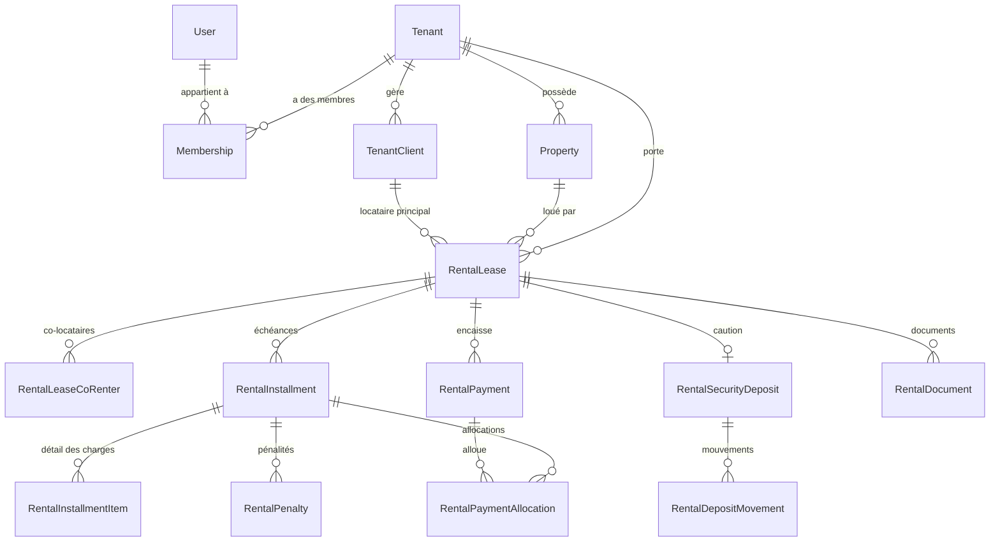

# Modèle de données — ImmoTopia

Ce document décrit le schéma Prisma tel qu'il est aujourd'hui, sans recopier
la liste des champs. Pour les colonnes exactes, ouvrir
`packages/api/prisma/schema.prisma`.

`docs/architecture/database-schema.md` est **partiel et daté**
(2025-01-27, écrit pour 38 des 192 modèles actuels d'après
[docs/README.md](../README.md)). Ne pas s'y fier pour un travail en cours :
`schema.prisma` est la seule référence à jour.

## Compte exact (2026-09-27)

Compté avec :

```bash
grep -c "^model " packages/api/prisma/schema.prisma   # 192
grep -c "^enum "  packages/api/prisma/schema.prisma   # 162
wc -l packages/api/prisma/schema.prisma               # 7571 lignes
```

- **192 modèles**
- **162 enums**

## Modèles par domaine

Regroupement fonctionnel (un modèle n'apparaît qu'une fois, dans son domaine
principal ; certains domaines se recoupent — par exemple `Property` sert à la
fois au CRM et à la gestion locative).

| Domaine                              | Modèles principaux                                                                                                                                                                                                                                                                                                                                                                                                                                                                                                                                                                                                   | Rôle                                                                                                                                            |
| ------------------------------------ | -------------------------------------------------------------------------------------------------------------------------------------------------------------------------------------------------------------------------------------------------------------------------------------------------------------------------------------------------------------------------------------------------------------------------------------------------------------------------------------------------------------------------------------------------------------------------------------------------------------------- | ----------------------------------------------------------------------------------------------------------------------------------------------- |
| Plateforme / agences                 | `Tenant`, `TenantModule`, `Invitation`                                                                                                                                                                                                                                                                                                                                                                                                                                                                                                                                                                               | L'agence elle-même, ses modules activés, ses invitations.                                                                                       |
| Abonnements & facturation par packs  | `Subscription`, `SubscriptionItem`, `Invoice`, `InvoiceLine`, `PlatformInvoiceSequence`, `PlatformInvoicePayment`, `PlatformPaymentCheckout`, `CatalogItem`, `CatalogCapacity`, `CapacityOverride`, `LotActivation`, `UsageSnapshot`, `QuotaAlert`, `SubscriptionExtensionRequest`                                                                                                                                                                                                                                                                                                                                   | Packs commerciaux, réserve de lots, dépassements facturés, factures émises par la plateforme (voir [PLAN-ABONNEMENTS.md](PLAN-ABONNEMENTS.md)). |
| Utilisateurs / RBAC                  | `User`, `RefreshToken`, `PasswordResetToken`, `EmailVerificationToken`, `Membership`, `Role`, `Permission`, `RolePermission`, `UserRole`, `RoleMenuAccess`                                                                                                                                                                                                                                                                                                                                                                                                                                                           | Comptes, sessions, rattachement à une ou plusieurs agences (`Membership`), permissions.                                                         |
| CRM                                  | `CrmContact`, `CrmContactRole`, `CrmDeal`, `CrmActivity`, `CrmDealProperty`, `CrmTag`, `CrmContactTag`, `CrmContactTargetZone`, `CrmNote`                                                                                                                                                                                                                                                                                                                                                                                                                                                                            | Contacts, opportunités, activités commerciales.                                                                                                 |
| Biens                                | `Property`, `PropertyTypeTemplate`, `PropertyMedia`, `PropertyDocument`, `PropertyStatusHistory`, `PropertyVisit`, `PropertyVisitCollaborator`, `PropertyMandate`, `PropertyQualityScore`, `PropertyOwnershipShare`                                                                                                                                                                                                                                                                                                                                                                                                  | Fiches de biens, médias, mandats, visites, indivision.                                                                                          |
| Géographie                           | `Country`, `Region`, `Commune`                                                                                                                                                                                                                                                                                                                                                                                                                                                                                                                                                                                       | Référentiel hiérarchique public, partagé entre agences.                                                                                         |
| Gestion locative                     | `TenantClient`, `RentalLease`, `RentalLeaseCoRenter`, `RentalInstallment`, `RentalInstallmentItem`, `RentalPayment`, `RentalPaymentAllocation`, `RentalRefund`, `RentalPenaltyRule`, `RentalPenalty`, `RentalSecurityDeposit`, `RentalDepositMovement`, `RentalDocument`, `DocumentTemplate`, `DocumentCounter`, `RentalPaymentDeclaration`, `LeaseEvent`, `LeaseInspection`, `LeaseInspectionPhoto`, `LeaseManagementTerms`, `RentBillingRun`                                                                                                                                                                       | Cycle de vie du bail : échéances, paiements, pénalités, caution, états des lieux.                                                               |
| Paiement en ligne                    | `PaymentGatewayConfig`, `OnlinePaymentCheckout`                                                                                                                                                                                                                                                                                                                                                                                                                                                                                                                                                                      | Configuration et sessions de paiement PaySecureHub par agence (lot 7).                                                                          |
| Finance / comptabilité générale      | `ChartOfAccount`, `AccountingJournal`, `JournalEntry`, `JournalEntryLine`, `OwnerAccount`, `OwnerAccountTransaction`, `AgencyFinanceSettings`, `ThirdPartyAccount`, `ThirdPartyMovement`, `VoidDocument`                                                                                                                                                                                                                                                                                                                                                                                                             | Plan comptable, écritures, comptes tiers/propriétaires, annulation de documents.                                                                |
| Propriétaires & honoraires           | `OwnerManagementTerms`, `ManagementFee`, `AgentCommissionRate`, `OwnerStatement`, `OwnerStatementItem`, `OwnerPayout`                                                                                                                                                                                                                                                                                                                                                                                                                                                                                                | Conditions de gestion, honoraires, relevés et reversements aux propriétaires.                                                                   |
| Patrimoine                           | `Asset`, `AssetValuation`, `PropertyLoan`, `PropertyExpense`, `WorkProgram`, `PatrimonyDocument`                                                                                                                                                                                                                                                                                                                                                                                                                                                                                                                     | Valorisation d'actifs, emprunts, travaux liés à un bien détenu ; `Asset` est la racine multi-classes (ADR-005).                                 |
| Trésorerie & caisse                  | `CashSession`, `TreasuryAccount`, `TreasuryTransfer`, `RentWithholding`, `TaxRemittance`                                                                                                                                                                                                                                                                                                                                                                                                                                                                                                                             | Sessions de caisse d'agence, comptes de trésorerie, retenues et reversements fiscaux.                                                           |
| Syndic / copropriété                 | `Syndicate`, `SyndicateLot`, `LotTenantAssignment`, `LotOwnerProfile`, `LotTenantProfile`, `SyndicateMaintenanceLink`, `SyndicateContractLink`, `ChargeCall`, `ChargeCallBatch`, `ChargePayment`, `GeneralMeeting`, `GMAgendaItem`, `GMResolution`, `GMVote`, `GMProxy`, `ServiceProvider`, `MaintenanceContract`, `CommonAreaAsset`, `SyndicateDocument`, `SyndicateFund`, `SyndicPaymentMethod`, `PaymentReminder`, `LatePaymentPenalty`, `PaymentSchedule`, `PaymentScheduleInstalment`, `ReminderConfig`, `SyndicateBudget`, `BudgetLineItem`, `BudgetAllocation`, `SyndicateIncident`, `IncidentCostImputation` | Assemblées générales, appels de charges, budgets, incidents de copropriété.                                                                     |
| Chantiers (promotion / construction) | `ConstructionSite`, `CostCategory`, `CostAllocation`, `CashVoucher`, `SiteBudget`, `SiteBudgetLine`, `SiteBudgetAlert`, `BudgetAmendment`, `BudgetAmendmentLine`, `PurchaseOrder`, `PurchaseOrderLine`, `SiteProgressEntry`, `SiteLot`, `LandLease`, `LandLeasePayment`, `LandLeaseAccrual`, `Partnership`, `PartnershipShare`, `PartnershipDistribution`, `Employee`, `SalaryNote`, `SalaryPayment`, `Contractor`, `ContractorContract`, `ProgressStatement`, `ContractorPayment`, `RetentionGuarantee`                                                                                                             | Suivi financier d'un chantier : budgets, avenants, bons de commande, associations, salaires, tâcherons.                                         |
| Fournisseurs                         | `Supplier`, `SupplierInvoice`, `SupplierInvoiceLine`, `SupplierPayment`, `SupplierPaymentAllocation`                                                                                                                                                                                                                                                                                                                                                                                                                                                                                                                 | Achats et règlements fournisseurs.                                                                                                              |
| Stock                                | `StockSettings`, `StockItem`, `StockLocation`, `StockBalance`, `StockMovement`, `StockCount`, `StockCountLine`                                                                                                                                                                                                                                                                                                                                                                                                                                                                                                       | Articles, entrepôts, mouvements et inventaires.                                                                                                 |
| Maintenance                          | `MaintenanceTicket`, `MaintenanceTicketAttachment`, `MaintenanceTicketComment`, `MaintenanceTicketStatusHistory`, `MaintenanceVendor`                                                                                                                                                                                                                                                                                                                                                                                                                                                                                | Tickets d'incident locatif et prestataires.                                                                                                     |
| Ventes immobilières                  | `SaleMandate`, `SaleOffer`, `SaleAgreement`, `SaleAgreementCondition`, `SalePaymentMilestone`, `SaleCommission`, `SaleCommissionPayment`                                                                                                                                                                                                                                                                                                                                                                                                                                                                             | Mandats de vente, offres, compromis, commissions.                                                                                               |
| Communication                        | `Communication`, `CommunicationPreference`, `EmailNotificationConfig`, `WhatsappNotificationConfig`, `WhatsappGroupInviteLog`                                                                                                                                                                                                                                                                                                                                                                                                                                                                                        | Historique et configuration des canaux e-mail/WhatsApp.                                                                                         |
| Newsletter                           | `NewsletterList`, `NewsletterSubscriber`, `NewsletterCampaign`, `NewsletterCampaignRecipient`, `NewsletterTemplate`                                                                                                                                                                                                                                                                                                                                                                                                                                                                                                  | Listes de diffusion et campagnes.                                                                                                               |
| Documents & audit                    | `AuditLog`, `SavedContactSearch`                                                                                                                                                                                                                                                                                                                                                                                                                                                                                                                                                                                     | Piste d'audit plateforme, recherches sauvegardées.                                                                                              |

## Patrimoine multi-actifs (lot 1, ADR-005)

Migration `20261004160000_patrimoine_multi_actifs`. Détail :
[specs/023-patrimoine-multi-actifs/data-model.md](../../specs/023-patrimoine-multi-actifs/data-model.md).

- Enums : `AssetClass` (10 classes), `AssetStatus` (`ACTIVE`, `DISPOSED`, `ARCHIVED`),
  `ValuationReliability` (`HIGH`, `MEDIUM`, `LOW`).
- `Asset` (table `assets`, porte `tenantId`) : racine du patrimoine. `propertyId`
  unique et facultatif (FK `Property`, `Restrict`), réservé à `REAL_ESTATE`
  (CHECK `assets_property_only_real_estate_chk`). `details` JSON + `detailsVersion`.
- `AssetValuation`, `PropertyLoan`, `PropertyHolding` : `propertyId` devient
  facultatif, `assetId` facultatif s'ajoute. CHECK SQL : valorisation et part
  détenue = exactement un de (`property_id`, `asset_id`) ; prêt = au plus un
  (aucun = dette personnelle). `PropertyHolding` : unicité `(assetId, entityId)` en
  plus de `(propertyId, entityId)`. Suppression d'un actif : cascade sur ses
  valorisations et parts, `Restrict` sur ses prêts (une dette ne disparaît pas en
  silence). `AssetValuation` gagne `source` et `reliability` (lot 2).
- Lot 2 (spec 024), migration `20261004180000_valorisation_par_classe` :
  `ValuationMethod` passe de 3 à 11 valeurs (`DEPRECIATION_LINEAR`,
  `DEPRECIATION_DECLINING`, `EQUITY_SHARE`, `UNIT_COST`, `BALANCE`,
  `ACCRUED_SAVINGS`, `DISCOUNTED_CLAIM`, `UNIT_VALUE`) et `AssetValuation` gagne
  `reliabilityReasons` (`text[] NOT NULL DEFAULT '{}'`, clés de raison stables ; écrit à la saisie, la lecture
  recalcule la fiabilité effective).
- Lot 3 (spec 025), migration `20261004190000_patrimoine_scenarios` : enum
  `ProjectionScenarioKey` (`PRUDENT`, `CENTRAL`, `OPTIMISTIC`) et `PatrimonyScenario`
  (table `patrimony_scenarios`, porte `tenantId`, FK `Tenant` en `Cascade`) : hypothèses
  (`assumptions`) et opérations de simulation (`operations`) en JSON versionné
  (`schemaVersion`), jamais de résultat de calcul. Unicité `(tenantId, name)`, index
  `(tenantId, updatedAt)` ; CHECK SQL `horizon_years BETWEEN 1 AND 30` et
  `char_length(name) BETWEEN 1 AND 120`.
- `PatrimonyDocument` : `assetId` facultatif (`SetNull`).
- `PropertyExpense`, `WorkProgram`, `OwnerStatement*` : inchangés, rattachés au bien.
- Données : un `Asset` `REAL_ESTATE` est créé par bien portant des données
  patrimoniales ou détenu en propre (activation `HELD_PROPERTY` ouverte) ; les
  biens sans tenant sont ignorés ; aucune ligne existante n'est réécrite.
- Le comptage ci-dessus (192 modèles) date du 2026-09-27 ; le schéma en compte
  désormais davantage (`Asset` inclus).

## Motifs transverses

### Scoping par tenant

Le schéma ne porte **pas** un champ `tenantId` uniforme : deux conventions
coexistent, vérifiées par comptage direct sur `schema.prisma` :

- **110 modèles** portent un champ `tenantId` (camelCase, convention
  actuelle).
- **23 modèles plus anciens** portent le champ non mappé `tenant_id`
  (snake_case, nom de champ Prisma identique au nom de colonne).

`utils/tenant-ownership.ts` (`assertBelongsToTenant`) accepte les deux via
son option `tenantField`. `utils/prisma-tenant-guard-extension.ts` dérive la
liste des modèles gardés directement de `Prisma.dmmf` en cherchant l'un ou
l'autre champ — rien à maintenir à la main pour un modèle qui en porte un.

Les modèles qui ne portent ni l'un ni l'autre relèvent de deux catégories,
vérifiées automatiquement par
`packages/api/__tests__/unit/schema-tenant-coverage.test.ts` :

- **ENFANT** : pas de champ d'agence propre, mais un chemin de relation
  obligatoire déclaré dans `CHILD_MODELS` vers un ancêtre cloisonné (exemples
  vérifiés dans le test : `CrmContactTag` → `contact`, `PropertyQualityScore`
  → `property`, `ChargePayment` → `chargeCall` → `syndicate`).
- **GLOBAL** : plateforme, sans notion d'agence, listé et commenté un par un
  dans `GLOBAL_MODELS` — par exemple `User` (un compte peut appartenir à
  plusieurs agences via `Membership`), `Tenant` lui-même, `Role` et
  `Permission` (catalogues), `Country`/`Region`/`Commune` (référentiel
  géographique public), `PropertyTypeTemplate` et `CatalogItem`/
  `CatalogCapacity` (catalogues partagés entre agences).

Un nouveau modèle qui n'entre dans aucune des trois catégories fait échouer
ce test avec un message qui indique quoi faire — c'est le test à faire
passer pour tout nouveau modèle (voir AGENTS.md).

Pour les biens et leurs enfants spécifiquement (médias, documents,
historique de statut — non cloisonnés directement), le chemin obligatoire
passe par `utils/property-tenant-guard.ts`
(`getPropertyForTenant(propertyId, tenantId)`), qui lève `NotFoundError` si
le bien n'existe pas ou appartient à une autre agence — la même erreur dans
les deux cas, pour ne jamais confirmer l'existence d'un bien d'une agence
tierce.

### Précision monétaire

Tous les montants sont typés `Decimal` avec une échelle explicite —
**203 déclarations `Decimal` dans le schéma** (compté par `grep -c Decimal`).
Convention observée : `@db.Decimal(12, 2)` ou `@db.Decimal(14, 2)` pour les
montants (loyers, échéances, paiements, factures), `@db.Decimal(5, 2)` pour
les taux/pourcentages, `@db.Decimal(12, 4)` pour certains taux de pénalité.
Jamais de `Float` pour un montant.

### Dates

`DateTime` partout (`created_at`/`createdAt`, `updated_at`/`updatedAt` avec
`@updatedAt`), cohérent avec les deux conventions de nommage de champs
décrites ci-dessus. Les dates métier (échéance, début/fin de bail...)
suivent la même convention que le reste du modèle auquel elles appartiennent.

### Suppression logique

**Aucun champ `deletedAt` dans le schéma** (0 occurrence, vérifié par
`grep -c deletedAt`). Il n'y a donc pas de motif de suppression logique
généralisé : l'archivage/l'annulation passent par un enum de statut dédié
sur chaque modèle concerné (`PropertyStatus.ARCHIVED`,
`RentalLeaseStatus.CANCELED`, `RentalDocumentStatus.VOID`,
`SubscriptionStatus.CANCELED`, etc.), pas par un champ générique. 36 modèles
portent en revanche un booléen `isActive` (référentiels géographiques,
rôles, prestataires...) pour un statut actif/inactif simple.

### Enums d'état importants

- `RentalLeaseStatus` : `DRAFT → ACTIVE → SUSPENDED → ENDED/CANCELED`.
- `RentalInstallmentStatus` : `DRAFT → DUE → PARTIAL → PAID/OVERDUE/CANCELED`.
- `RentalPaymentStatus` : `PENDING → SUCCESS/FAILED/CANCELED/REFUNDED/PARTIALLY_REFUNDED`.
- `PropertyStatus` : `DRAFT → UNDER_REVIEW → AVAILABLE → RESERVED/UNDER_OFFER → RENTED/SOLD → ARCHIVED`.
- `SubscriptionStatus` : `TRIALING → ACTIVE → PAST_DUE → CANCELED/SUSPENDED`.
- `InvoiceStatus` : `DRAFT → ISSUED → PAID/FAILED/CANCELED/REFUNDED`.
- `TenantStatus` : `PENDING → ACTIVE → SUSPENDED`.
- `MembershipStatus` : `PENDING_INVITE → ACTIVE → DISABLED`.
- `SyndicateStatus`, `MeetingStatus`, `ResolutionResult` : cycle de vie
  d'une assemblée générale de copropriété (voir `docs/README.md` §
  « PR empilées Syndic » pour le contexte récent).

## Relations clés (cœur du système)

Diagramme limité aux modèles centraux, noms réels du schéma. Les
multiplicités reflètent les `@relation` effectivement déclarées (par
exemple `RentalLease` a un `primaryRenter` et un `ownerClient` optionnel,
tous deux des `TenantClient`).



## Pour aller plus loin

- Vue d'ensemble de l'architecture : [SYSTEM_DESIGN.md](SYSTEM_DESIGN.md).
- Schéma partiel et daté (à ne pas utiliser comme référence) :
  [database-schema.md](database-schema.md).
- Abonnements par packs (modèles `Subscription*`, `CatalogItem`,
  `LotActivation`) : [PLAN-ABONNEMENTS.md](PLAN-ABONNEMENTS.md).
- Isolation multi-tenant, règles impératives : voir la section correspondante
  d'[AGENTS.md](../../AGENTS.md).
