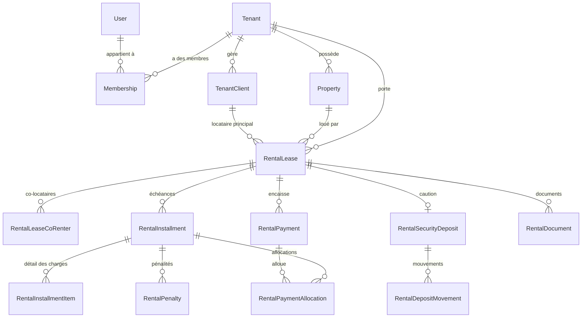

# Modèle de données — ImmoTopia

Ce document décrit le schéma Prisma tel qu'il est aujourd'hui, sans recopier
la liste des champs. Pour les colonnes exactes, ouvrir
`packages/api/prisma/schema.prisma`.

`docs/architecture/database-schema.md` est **partiel et daté**
(2025-01-27, écrit pour 38 des 192 modèles actuels d'après
[docs/README.md](../README.md)). Ne pas s'y fier pour un travail en cours :
`schema.prisma` est la seule référence à jour.

## Compte exact (2026-09-27)

Compté avec :

```bash
grep -c "^model " packages/api/prisma/schema.prisma   # 192
grep -c "^enum "  packages/api/prisma/schema.prisma   # 162
wc -l packages/api/prisma/schema.prisma               # 7571 lignes
```

- **192 modèles**
- **162 enums**

## Modèles par domaine

Regroupement fonctionnel (un modèle n'apparaît qu'une fois, dans son domaine
principal ; certains domaines se recoupent — par exemple `Property` sert à la
fois au CRM et à la gestion locative).

| Domaine                              | Modèles principaux                                                                                                                                                                                                                                                                                                                                                                                                                                                                                                                                                                                                   | Rôle                                                                                                                                            |
| ------------------------------------ | -------------------------------------------------------------------------------------------------------------------------------------------------------------------------------------------------------------------------------------------------------------------------------------------------------------------------------------------------------------------------------------------------------------------------------------------------------------------------------------------------------------------------------------------------------------------------------------------------------------------- | ----------------------------------------------------------------------------------------------------------------------------------------------- |
| Plateforme / agences                 | `Tenant`, `TenantModule`, `Invitation`                                                                                                                                                                                                                                                                                                                                                                                                                                                                                                                                                                               | L'agence elle-même, ses modules activés, ses invitations.                                                                                       |
| Abonnements & facturation par packs  | `Subscription`, `SubscriptionItem`, `Invoice`, `InvoiceLine`, `PlatformInvoiceSequence`, `PlatformInvoicePayment`, `PlatformPaymentCheckout`, `CatalogItem`, `CatalogCapacity`, `CapacityOverride`, `LotActivation`, `UsageSnapshot`, `QuotaAlert`, `SubscriptionExtensionRequest`                                                                                                                                                                                                                                                                                                                                   | Packs commerciaux, réserve de lots, dépassements facturés, factures émises par la plateforme (voir [PLAN-ABONNEMENTS.md](PLAN-ABONNEMENTS.md)). |
| Utilisateurs / RBAC                  | `User`, `RefreshToken`, `PasswordResetToken`, `EmailVerificationToken`, `Membership`, `Role`, `Permission`, `RolePermission`, `UserRole`, `RoleMenuAccess`                                                                                                                                                                                                                                                                                                                                                                                                                                                           | Comptes, sessions, rattachement à une ou plusieurs agences (`Membership`), permissions.                                                         |
| CRM                                  | `CrmContact`, `CrmContactRole`, `CrmDeal`, `CrmActivity`, `CrmDealProperty`, `CrmTag`, `CrmContactTag`, `CrmContactTargetZone`, `CrmNote`                                                                                                                                                                                                                                                                                                                                                                                                                                                                            | Contacts, opportunités, activités commerciales.                                                                                                 |
| Biens                                | `Property`, `PropertyTypeTemplate`, `PropertyMedia`, `PropertyDocument`, `PropertyStatusHistory`, `PropertyVisit`, `PropertyVisitCollaborator`, `PropertyMandate`, `PropertyQualityScore`, `PropertyOwnershipShare`                                                                                                                                                                                                                                                                                                                                                                                                  | Fiches de biens, médias, mandats, visites, indivision.                                                                                          |
| Géographie                           | `Country`, `Region`, `Commune`                                                                                                                                                                                                                                                                                                                                                                                                                                                                                                                                                                                       | Référentiel hiérarchique public, partagé entre agences.                                                                                         |
| Gestion locative                     | `TenantClient`, `RentalLease`, `RentalLeaseCoRenter`, `RentalInstallment`, `RentalInstallmentItem`, `RentalPayment`, `RentalPaymentAllocation`, `RentalRefund`, `RentalPenaltyRule`, `RentalPenalty`, `RentalSecurityDeposit`, `RentalDepositMovement`, `RentalDocument`, `DocumentTemplate`, `DocumentCounter`, `RentalPaymentDeclaration`, `LeaseEvent`, `LeaseInspection`, `LeaseInspectionPhoto`, `LeaseManagementTerms`, `RentBillingRun`                                                                                                                                                                       | Cycle de vie du bail : échéances, paiements, pénalités, caution, états des lieux.                                                               |
| Paiement en ligne                    | `PaymentGatewayConfig`, `OnlinePaymentCheckout`                                                                                                                                                                                                                                                                                                                                                                                                                                                                                                                                                                      | Configuration et sessions de paiement PaySecureHub par agence (lot 7).                                                                          |
| Finance / comptabilité générale      | `ChartOfAccount`, `AccountingJournal`, `JournalEntry`, `JournalEntryLine`, `OwnerAccount`, `OwnerAccountTransaction`, `AgencyFinanceSettings`, `ThirdPartyAccount`, `ThirdPartyMovement`, `VoidDocument`                                                                                                                                                                                                                                                                                                                                                                                                             | Plan comptable, écritures, comptes tiers/propriétaires, annulation de documents.                                                                |
| Propriétaires & honoraires           | `OwnerManagementTerms`, `ManagementFee`, `AgentCommissionRate`, `OwnerStatement`, `OwnerStatementItem`, `OwnerPayout`                                                                                                                                                                                                                                                                                                                                                                                                                                                                                                | Conditions de gestion, honoraires, relevés et reversements aux propriétaires.                                                                   |
| Patrimoine                           | `AssetValuation`, `PropertyLoan`, `PropertyExpense`, `WorkProgram`, `PatrimonyDocument`                                                                                                                                                                                                                                                                                                                                                                                                                                                                                                                              | Valorisation d'actifs, emprunts, travaux liés à un bien détenu.                                                                                 |
| Trésorerie & caisse                  | `CashSession`, `TreasuryAccount`, `TreasuryTransfer`, `RentWithholding`, `TaxRemittance`                                                                                                                                                                                                                                                                                                                                                                                                                                                                                                                             | Sessions de caisse d'agence, comptes de trésorerie, retenues et reversements fiscaux.                                                           |
| Syndic / copropriété                 | `Syndicate`, `SyndicateLot`, `LotTenantAssignment`, `LotOwnerProfile`, `LotTenantProfile`, `SyndicateMaintenanceLink`, `SyndicateContractLink`, `ChargeCall`, `ChargeCallBatch`, `ChargePayment`, `GeneralMeeting`, `GMAgendaItem`, `GMResolution`, `GMVote`, `GMProxy`, `ServiceProvider`, `MaintenanceContract`, `CommonAreaAsset`, `SyndicateDocument`, `SyndicateFund`, `SyndicPaymentMethod`, `PaymentReminder`, `LatePaymentPenalty`, `PaymentSchedule`, `PaymentScheduleInstalment`, `ReminderConfig`, `SyndicateBudget`, `BudgetLineItem`, `BudgetAllocation`, `SyndicateIncident`, `IncidentCostImputation` | Assemblées générales, appels de charges, budgets, incidents de copropriété.                                                                     |
| Chantiers (promotion / construction) | `ConstructionSite`, `CostCategory`, `CostAllocation`, `CashVoucher`, `SiteBudget`, `SiteBudgetLine`, `SiteBudgetAlert`, `BudgetAmendment`, `BudgetAmendmentLine`, `PurchaseOrder`, `PurchaseOrderLine`, `SiteProgressEntry`, `SiteLot`, `LandLease`, `LandLeasePayment`, `LandLeaseAccrual`, `Partnership`, `PartnershipShare`, `PartnershipDistribution`, `Employee`, `SalaryNote`, `SalaryPayment`, `Contractor`, `ContractorContract`, `ProgressStatement`, `ContractorPayment`, `RetentionGuarantee`                                                                                                             | Suivi financier d'un chantier : budgets, avenants, bons de commande, associations, salaires, tâcherons.                                         |
| Fournisseurs                         | `Supplier`, `SupplierInvoice`, `SupplierInvoiceLine`, `SupplierPayment`, `SupplierPaymentAllocation`                                                                                                                                                                                                                                                                                                                                                                                                                                                                                                                 | Achats et règlements fournisseurs.                                                                                                              |
| Stock                                | `StockSettings`, `StockItem`, `StockLocation`, `StockBalance`, `StockMovement`, `StockCount`, `StockCountLine`                                                                                                                                                                                                                                                                                                                                                                                                                                                                                                       | Articles, entrepôts, mouvements et inventaires.                                                                                                 |
| Maintenance                          | `MaintenanceTicket`, `MaintenanceTicketAttachment`, `MaintenanceTicketComment`, `MaintenanceTicketStatusHistory`, `MaintenanceVendor`                                                                                                                                                                                                                                                                                                                                                                                                                                                                                | Tickets d'incident locatif et prestataires.                                                                                                     |
| Ventes immobilières                  | `SaleMandate`, `SaleOffer`, `SaleAgreement`, `SaleAgreementCondition`, `SalePaymentMilestone`, `SaleCommission`, `SaleCommissionPayment`                                                                                                                                                                                                                                                                                                                                                                                                                                                                             | Mandats de vente, offres, compromis, commissions.                                                                                               |
| Communication                        | `Communication`, `CommunicationPreference`, `EmailNotificationConfig`, `WhatsappNotificationConfig`, `WhatsappGroupInviteLog`                                                                                                                                                                                                                                                                                                                                                                                                                                                                                        | Historique et configuration des canaux e-mail/WhatsApp.                                                                                         |
| Newsletter                           | `NewsletterList`, `NewsletterSubscriber`, `NewsletterCampaign`, `NewsletterCampaignRecipient`, `NewsletterTemplate`                                                                                                                                                                                                                                                                                                                                                                                                                                                                                                  | Listes de diffusion et campagnes.                                                                                                               |
| Documents & audit                    | `AuditLog`, `SavedContactSearch`                                                                                                                                                                                                                                                                                                                                                                                                                                                                                                                                                                                     | Piste d'audit plateforme, recherches sauvegardées.                                                                                              |

## Motifs transverses

### Scoping par tenant

Le schéma ne porte **pas** un champ `tenantId` uniforme : deux conventions
coexistent, vérifiées par comptage direct sur `schema.prisma` :

- **110 modèles** portent un champ `tenantId` (camelCase, convention
  actuelle).
- **23 modèles plus anciens** portent le champ non mappé `tenant_id`
  (snake_case, nom de champ Prisma identique au nom de colonne).

`utils/tenant-ownership.ts` (`assertBelongsToTenant`) accepte les deux via
son option `tenantField`. `utils/prisma-tenant-guard-extension.ts` dérive la
liste des modèles gardés directement de `Prisma.dmmf` en cherchant l'un ou
l'autre champ — rien à maintenir à la main pour un modèle qui en porte un.

Les modèles qui ne portent ni l'un ni l'autre relèvent de deux catégories,
vérifiées automatiquement par
`packages/api/__tests__/unit/schema-tenant-coverage.test.ts` :

- **ENFANT** : pas de champ d'agence propre, mais un chemin de relation
  obligatoire déclaré dans `CHILD_MODELS` vers un ancêtre cloisonné (exemples
  vérifiés dans le test : `CrmContactTag` → `contact`, `PropertyQualityScore`
  → `property`, `ChargePayment` → `chargeCall` → `syndicate`).
- **GLOBAL** : plateforme, sans notion d'agence, listé et commenté un par un
  dans `GLOBAL_MODELS` — par exemple `User` (un compte peut appartenir à
  plusieurs agences via `Membership`), `Tenant` lui-même, `Role` et
  `Permission` (catalogues), `Country`/`Region`/`Commune` (référentiel
  géographique public), `PropertyTypeTemplate` et `CatalogItem`/
  `CatalogCapacity` (catalogues partagés entre agences).

Un nouveau modèle qui n'entre dans aucune des trois catégories fait échouer
ce test avec un message qui indique quoi faire — c'est le test à faire
passer pour tout nouveau modèle (voir AGENTS.md).

Pour les biens et leurs enfants spécifiquement (médias, documents,
historique de statut — non cloisonnés directement), le chemin obligatoire
passe par `utils/property-tenant-guard.ts`
(`getPropertyForTenant(propertyId, tenantId)`), qui lève `NotFoundError` si
le bien n'existe pas ou appartient à une autre agence — la même erreur dans
les deux cas, pour ne jamais confirmer l'existence d'un bien d'une agence
tierce.

### Précision monétaire

Tous les montants sont typés `Decimal` avec une échelle explicite —
**203 déclarations `Decimal` dans le schéma** (compté par `grep -c Decimal`).
Convention observée : `@db.Decimal(12, 2)` ou `@db.Decimal(14, 2)` pour les
montants (loyers, échéances, paiements, factures), `@db.Decimal(5, 2)` pour
les taux/pourcentages, `@db.Decimal(12, 4)` pour certains taux de pénalité.
Jamais de `Float` pour un montant.

### Dates

`DateTime` partout (`created_at`/`createdAt`, `updated_at`/`updatedAt` avec
`@updatedAt`), cohérent avec les deux conventions de nommage de champs
décrites ci-dessus. Les dates métier (échéance, début/fin de bail...)
suivent la même convention que le reste du modèle auquel elles appartiennent.

### Suppression logique

**Aucun champ `deletedAt` dans le schéma** (0 occurrence, vérifié par
`grep -c deletedAt`). Il n'y a donc pas de motif de suppression logique
généralisé : l'archivage/l'annulation passent par un enum de statut dédié
sur chaque modèle concerné (`PropertyStatus.ARCHIVED`,
`RentalLeaseStatus.CANCELED`, `RentalDocumentStatus.VOID`,
`SubscriptionStatus.CANCELED`, etc.), pas par un champ générique. 36 modèles
portent en revanche un booléen `isActive` (référentiels géographiques,
rôles, prestataires...) pour un statut actif/inactif simple.

### Enums d'état importants

- `RentalLeaseStatus` : `DRAFT → ACTIVE → SUSPENDED → ENDED/CANCELED`.
- `RentalInstallmentStatus` : `DRAFT → DUE → PARTIAL → PAID/OVERDUE/CANCELED`.
- `RentalPaymentStatus` : `PENDING → SUCCESS/FAILED/CANCELED/REFUNDED/PARTIALLY_REFUNDED`.
- `PropertyStatus` : `DRAFT → UNDER_REVIEW → AVAILABLE → RESERVED/UNDER_OFFER → RENTED/SOLD → ARCHIVED`.
- `SubscriptionStatus` : `TRIALING → ACTIVE → PAST_DUE → CANCELED/SUSPENDED`.
- `LandRegularizationStatus` : `EN_COURS → TERMINEE/ABANDONNEE` (réouverture possible avec motif) ;
  `LandStepStatus` : `A_FAIRE ↔ EN_COURS ↔ BLOQUEE`, `→ TERMINEE` (voir la section
  « LandRegularization »).
- `InvoiceStatus` : `DRAFT → ISSUED → PAID/FAILED/CANCELED/REFUNDED`.
- `TenantStatus` : `PENDING → ACTIVE → SUSPENDED`.
- `MembershipStatus` : `PENDING_INVITE → ACTIVE → DISABLED`.
- `SyndicateStatus`, `MeetingStatus`, `ResolutionResult` : cycle de vie
  d'une assemblée générale de copropriété (voir `docs/README.md` §
  « PR empilées Syndic » pour le contexte récent).

## SecureLink — liens publics à jeton (lot A3, spec 031)

Modèle générique des liens partageables sans compte, ajouté par la spec
[031](../../specs/031-patrimoine-canaux-liens-securises/spec.md) ; le premier usage est
le rapport mensuel d'un propriétaire. Il relève du domaine « Documents & audit » ; les
comptes ci-dessus ne le comptent pas tant que la migration n'est pas fusionnée. Modèle de
menace : [SECURITY.md](../governance/SECURITY.md), section « 12 bis. Liens publics à jeton ».

| Champ             | Type              | Règle                                                                                                                          |
| ----------------- | ----------------- | ------------------------------------------------------------------------------------------------------------------------------ |
| `id`              | `String` (UUID)   | clé primaire (colonne texte, `@default(uuid())`) ; table `secure_links`                                                        |
| `tenantId`        | `String`          | agence propriétaire du lien, obligatoire ; relation `Tenant`, `onDelete: Cascade`                                              |
| `scope`           | `SecureLinkScope` | portée du lien ; une seule valeur aujourd'hui, `OWNER_MONTHLY_REPORT` ; une route n'accepte que sa propre portée               |
| `objectType`      | `String`          | nom du modèle visé (`"OwnerStatement"`)                                                                                        |
| `objectId`        | `String`          | identifiant de l'objet visé                                                                                                    |
| `tokenHash`       | `String` (unique) | SHA-256 du jeton ; **jamais le jeton**                                                                                         |
| `expiresAt`       | `DateTime`        | 7 jours par défaut (`SECURE_LINK_DEFAULT_TTL_DAYS`), 30 au plus (`SECURE_LINK_MAX_TTL_DAYS`)                                   |
| `revokedAt`       | `DateTime?`       | posé à la révocation ; la ligne est conservée                                                                                  |
| `createdByUserId` | `String?`         | utilisateur créateur ; nul pour un lien créé par le job mensuel ; relation `User` `onDelete: SetNull` ; jamais `include: user` |
| `viewCount`       | `Int` (défaut 0)  | consultations réussies, incrémenté atomiquement                                                                                |
| `lastViewedAt`    | `DateTime?`       | dernière consultation réussie                                                                                                  |
| `createdAt`       | `DateTime`        | création                                                                                                                       |
| `updatedAt`       | `DateTime`        | `@updatedAt`                                                                                                                   |

**Index** : unique sur `tokenHash` (retrouve la ligne depuis le jeton reçu) ; index sur
`tenantId` ; index sur `(tenantId, objectType, objectId)` (liste des liens d'un relevé) ;
index sur `expiresAt`. Les colonnes sont en snake_case (`tenant_id`, `token_hash`…) ; le champ
Prisma reste en camelCase.

**Règles** :

- **Jeton** : 32 octets aléatoires, base64url, renvoyé **une seule fois** à la création ;
  seul son SHA-256 est stocké. Aucune colonne, aucun journal ni `AuditLog` ne contient le
  clair (ni le hash). Un jeton oublié ne se relit pas : on en crée un autre.
- **Pas de clé étrangère polymorphe** : `objectType` + `objectId` sont des chaînes, sans
  `@relation` vers l'objet visé. Le lien survit donc à l'objet sans contrainte ; la
  vérification relit l'objet par `id` **et** `tenantId` du lien, et refuse (404 uniforme) si
  l'objet a disparu. Ajouter une portée = ajouter une valeur à l'enum et une fonction de
  lecture de l'objet, sans toucher au schéma des modèles visés.
- **Isolation** : `tenantId` direct, donc gardé automatiquement par l'extension Prisma et
  vérifié par `schema-tenant-coverage.test.ts`. La recherche par `tokenHash` est la seule
  lecture faite avant que le contexte d'agence existe ; elle est confinée à
  `lib/secure-links` (voir SECURITY.md).
- **Cycle de vie** : actif tant que `revokedAt` est nul et `expiresAt` est futur. Pas de
  statut stocké : l'état se calcule. Pas de suppression logique générique : `revokedAt`
  sert d'historique.
- **Aucune réponse n'expose `tokenHash`** ; les listes d'agence renvoient l'identifiant, la
  portée, l'objet visé, les dates, `viewCount`, `lastViewedAt` et un état calculé
  (`ACTIVE`, `EXPIRED`, `REVOKED`).
- **Hors export d'agence** : `SecureLink` est exclu de l'export de données de l'agence
  (`services/tenant-data-export/model-registry.ts`), car le hash est un secret d'accès ; les
  consultations restent dans `AuditLog`.

## LandRegularization — régularisation foncière (lot B2, spec 033)

Suivi d'avancement de la régularisation foncière d'un bien (attestation villageoise, ACD,
titre foncier…), ajouté par la spec
[033](../../specs/033-patrimoine-regularisation-fonciere/spec.md) ; migration additive
`20261007130000_patrimoine_regularisation_fonciere`. Il relève du domaine « Patrimoine » ; les
comptes ci-dessus ne les comptent pas tant que la migration n'est pas fusionnée. Les filières
(`CI_ACD`, `PERSONNALISEE`) sont des **constantes de code** (`lib/patrimoine/land/tracks.ts`), pas
des tables : seul le suivi d'un bien est stocké.

**Enums** : `LandTrackKey` (`CI_ACD`, `PERSONNALISEE`) ; `LandRegularizationStatus`
(`EN_COURS`, `TERMINEE`, `ABANDONNEE`) ; `LandStepStatus` (`A_FAIRE`, `EN_COURS`, `TERMINEE`,
`BLOQUEE`).

### `LandRegularization` (table `land_regularizations`)

Un dossier de régularisation d'un bien. Un bien peut en avoir plusieurs dans le temps, **un seul
`EN_COURS`** à la fois.

| Champ             | Type                       | Règle                                                                                                   |
| ----------------- | -------------------------- | ------------------------------------------------------------------------------------------------------- |
| `id`              | `String` (UUID)            | clé primaire (colonne texte, `@default(uuid())`)                                                        |
| `tenantId`        | `String`                   | agence, obligatoire ; relation `Tenant`, `onDelete: Cascade`                                            |
| `propertyId`      | `String`                   | bien concerné, obligatoire ; relation `Property`, `onDelete: Cascade`                                   |
| `track`           | `LandTrackKey`             | filière suivie ; fixée à la création                                                                    |
| `status`          | `LandRegularizationStatus` | défaut `EN_COURS`                                                                                       |
| `startDate`       | `DateTime`                 | début du dossier, défaut maintenant                                                                     |
| `endedAt`         | `DateTime?`                | renseigné à la clôture (terminé ou abandonné)                                                           |
| `notes`           | `String?`                  | texte libre de l'agence                                                                                 |
| `createdByUserId` | `String?`                  | créateur ; relation `User` (`LandRegularizationCreatedBy`) `onDelete: SetNull` ; jamais `include: user` |
| `createdAt`       | `DateTime`                 | création                                                                                                |
| `updatedAt`       | `DateTime`                 | `@updatedAt`                                                                                            |

**Index** : `tenantId` ; `propertyId` ; `(tenantId, status)` ; et l'**index unique partiel**
`land_regularizations_one_active_per_property_key` sur `property_id` `WHERE "status" = 'EN_COURS'`.
Ce dernier n'est écrit **que dans la migration SQL** : Prisma ne sait pas exprimer un index
partiel, il n'apparaît donc pas comme `@@unique` dans `schema.prisma` (un commentaire le signale).
Ne jamais accepter qu'une migration générée le supprime.

### `LandRegularizationStep` (table `land_regularization_steps`)

Une étape d'un dossier. Les étapes d'une filière constante sont **copiées** à la création : le
dossier ne dépend plus de la constante ensuite.

| Champ              | Type             | Règle                                                                                                        |
| ------------------ | ---------------- | ------------------------------------------------------------------------------------------------------------ |
| `id`               | `String` (UUID)  | clé primaire                                                                                                 |
| `tenantId`         | `String`         | agence, **direct** (comme le dossier), obligatoire ; relation `Tenant`, `onDelete: Cascade`                  |
| `regularizationId` | `String`         | dossier ; relation `LandRegularization`, `onDelete: Cascade`                                                 |
| `stepKey`          | `String`         | clé de l'étape : clé du catalogue (`acd`, `titre_foncier`…) ou `custom_<n>`                                  |
| `sortOrder`        | `Int`            | rang de l'étape (colonne `sort_order`) ; unique par dossier                                                  |
| `label`            | `String`         | texte **français** (clé de traduction) pour une étape du catalogue, texte saisi pour une étape personnalisée |
| `required`         | `Boolean`        | défaut `true` ; toutes les étapes de `CI_ACD` sont obligatoires                                              |
| `status`           | `LandStepStatus` | défaut `A_FAIRE`                                                                                             |
| `startedAt`        | `DateTime?`      | posé au premier passage à `EN_COURS` ou `TERMINEE`, jamais effacé                                            |
| `completedAt`      | `DateTime?`      | posé à `TERMINEE`, remis à vide à la réouverture                                                             |
| `dueDate`          | `DateTime?`      | échéance ; sert au retard et à la relance                                                                    |
| `costXof`          | `Decimal(14,2)`  | frais engagés en XOF, défaut 0, jamais négatif (contrôlé par l'API)                                          |
| `notes`            | `String?`        | texte libre                                                                                                  |
| `documentId`       | `String?`        | pièce rattachée ; relation `PropertyDocument`, `onDelete: SetNull`                                           |
| `createdAt`        | `DateTime`       | création                                                                                                     |
| `updatedAt`        | `DateTime`       | `@updatedAt`                                                                                                 |

**Index** : unique `(regularizationId, sortOrder)` ; `tenantId` ; `regularizationId` ;
`(tenantId, status, dueDate)` (sélection des étapes en retard par l'alerte) ; `documentId`.
Colonnes en snake_case (`tenant_id`, `regularization_id`, `cost_xof`…) ; les champs Prisma restent
en camelCase.

### Règles d'intégrité

- **Un seul dossier `EN_COURS` par bien** : deux défenses, le contrôle du service (erreur 409
  claire) et l'index unique partiel en base ; la violation de l'index lors d'une création
  concurrente est convertie en la même erreur 409. La réouverture d'un dossier clos est refusée
  si un autre dossier est déjà `EN_COURS` sur le bien.
- **Isolation** : `tenantId` direct sur **les deux** modèles, donc gardés par l'extension Prisma
  et vérifiés par `schema-tenant-coverage.test.ts`. Tout identifiant reçu (bien, dossier, étape,
  document) est vérifié par agence ; `stepId` doit appartenir au dossier de l'URL.
- **Pièce du même bien** : `documentId` doit désigner un `PropertyDocument` de la même agence
  **et** du même bien que le dossier (la base ne le garantit pas : contrôle de service, test
  dédié). Les types de document sont les types existants (`TITLE_DEED`, `LAND_CONCESSION`, `PLAN`,
  `TAX_DOCUMENT`, `OTHER`) ; l'étape ne fournit qu'un type **suggéré**, aucun type n'est ajouté.
- **Suppressions** : supprimer le bien supprime ses dossiers et leurs étapes (cascade) ;
  supprimer un document rattaché vide `documentId` sans supprimer l'étape ; supprimer
  l'utilisateur créateur vide `createdByUserId`.
- **Transitions** : portées par une fonction pure (`lib/patrimoine/land/transitions.ts`), pas par
  la base : aucune contrainte `CHECK` sur l'ordre des statuts. Terminer une étape exige les
  obligatoires précédentes ; rouvrir exige un motif ; un dossier clos n'accepte plus de
  modification.
- **Aucun export vers le coût de revient** : `costXof` n'alimente ni `PropertyExpense`, ni
  `AssetValuation`, ni le rendement, ni la consolidation, ni les exports ; la somme des frais
  (`feesXof`) est calculée à la lecture et affichée à part sous le nom « frais de
  régularisation ». Leur intégration est un lot ultérieur.
- **Progression et retard calculés, jamais stockés** : pourcentage, étape courante, prochaine
  échéance et étapes en retard se dérivent des étapes à chaque lecture.
- **Audit** : `LAND_REGULARIZATION_CREATED`, `LAND_REGULARIZATION_STATUS_CHANGED`,
  `LAND_STEP_STATUS_CHANGED` (avec `reopened: true` à une réouverture), `LAND_STEP_UPDATED` et
  la marque anti-doublon `PATRIMOINE_LAND_STEP_OVERDUE_ALERT_SENT` (`entityId` =
  `<stepId>::<AAAA-MM-JJ de l'échéance>`) sont écrits dans `AuditLog`.
- **Export d'agence** : les deux modèles sont exportés avec le reste (l'export est dérivé du
  schéma, aucun secret n'y figure).

## Relations clés (cœur du système)

Diagramme limité aux modèles centraux, noms réels du schéma. Les
multiplicités reflètent les `@relation` effectivement déclarées (par
exemple `RentalLease` a un `primaryRenter` et un `ownerClient` optionnel,
tous deux des `TenantClient`).



## Pour aller plus loin

- Vue d'ensemble de l'architecture : [SYSTEM_DESIGN.md](SYSTEM_DESIGN.md).
- Schéma partiel et daté (à ne pas utiliser comme référence) :
  [database-schema.md](database-schema.md).
- Abonnements par packs (modèles `Subscription*`, `CatalogItem`,
  `LotActivation`) : [PLAN-ABONNEMENTS.md](PLAN-ABONNEMENTS.md).
- Isolation multi-tenant, règles impératives : voir la section correspondante
  d'[AGENTS.md](../../AGENTS.md).
