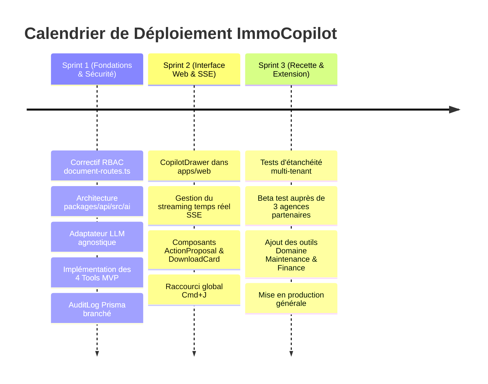

# PRD — ImmoCopilot : Assistant IA Opérationnel In-App

| Métadonnée          | Valeur                                                                                       |
| :------------------ | :------------------------------------------------------------------------------------------- |
| **Produit**         | ImmoTopia SaaS (Gestion immobilière multi-tenant)                                            |
| **Fonctionnalité**  | ImmoCopilot (Assistant conversationnel orienté actions)                                      |
| **Référence Wiki**  | `docs/fonctionnalites/ImmoTopia_Wiki_Fonctionnalites.xlsx` (619 sous-fonctionnalités)        |
| **Statut**          | Validé pour implémentation                                                                   |
| **Cible technique** | `apps/web` (React 18, Vite, Ant Design 6) & `packages/api` (Express 4, Prisma 5, PostgreSQL) |
| **Date**            | 29 Septembre 2026                                                                            |

---

## 1. Vision Produit & Résumé Exécutif

ImmoTopia dispose d'un catalogue riche de plus de 600 sous-fonctionnalités couvrant 9 domaines métier (Parc immobilier, Gestion locative, Syndic, Finance, Maintenance, etc.). Cependant, la multiplicité des menus, formulaires et options entraîne une surcharge cognitive pour les collaborateurs d'agence et ralentit les tâches administratives répétitives (recherche de biens, suivi des dossiers, édition de quittances, vérification des pièces).

**ImmoCopilot** est un assistant IA conversationnel intégré directement dans le SaaS. Il permet aux utilisateurs d'interagir en langage naturel pour :

1. **Consulter et filtrer** les données métier (biens, locataires, baux, impayés, tickets).
2. **Générer et exporter** des documents administratifs (quittances de loyer, avis d'échéance, contrats, rapports).
3. **Préparer et assister** la création ou modification d'entités avec un paradigme de validation humaine obligatoire (**Human-in-the-Loop**).

> [!IMPORTANT]
> L'assistant ne contourne jamais les règles d'étanchéité multi-tenant ni les contrôles RBAC existants. Le modèle d'IA agit comme un traducteur d'intention en appels d'outils strictement contrôlés côté serveur.

---

## 2. Objectifs & Indicateurs Clés de Succès (KPIs)

### 2.1. Objectifs Business & Utilisateurs

- **Gain de temps opérationnel** : Réduire de 70 % le temps moyen requis pour éditer et télécharger un document locatif standard.
- **Accessibilité des fonctionnalités** : Permettre aux nouveaux utilisateurs de manipuler l'application sans formation préalable complexe.
- **Zéro régression de sécurité** : 100 % des actions exécutées doivent respecter les limites strictes du `tenantId` et des permissions RBAC de la session active.

### 2.2. Indicateurs Clés de Performance (KPIs)

- **Taux d'adoption hebdomadaire** : $\ge 40\%$ des utilisateurs actifs recourent au moins une fois par semaine à l'assistant.
- **Taux de succès des outils (Tool Success Rate)** : $\ge 92\%$ des requêtes actionnables sont transformées en appels d'outils valides du premier coup.
- **Taux de validation humaine** : $\ge 95\%$ des prévisualisations de documents présentées sont confirmées par l'utilisateur sans abandon.
- **Temps de premier affichage (TTFT - Time To First Token)** : $< 800\text{ ms}$ via Server-Sent Events (SSE).

---

## 3. Personas & Matrice des Cas d'Usage

| Persona                       | Rôle & Permissions                                                       | Cas d'usage type                                                             | Bénéfice attendu                                               |
| :---------------------------- | :----------------------------------------------------------------------- | :--------------------------------------------------------------------------- | :------------------------------------------------------------- |
| **Agent de Gestion Locative** | `TENANT_AGENT`<br>`PROPERTIES_VIEW`, `RENTAL_VIEW`, `DOCUMENTS_GENERATE` | _"Sors la quittance du mois d'août de Mme Traoré pour le bail #L-102."_      | Génération immédiate sans naviguer dans l'historique des baux. |
| **Gestionnaire d'Agence**     | `TENANT_MANAGER`<br>+ `PROPERTIES_EDIT`, `RENTAL_EDIT`                   | _"Quels sont les appartements vacants à Cocody disponibles immédiatement ?"_ | Synthèse instantanée pour orienter un prospect au téléphone.   |
| **Responsable Maintenance**   | `TENANT_AGENT`<br>`MAINTENANCE_VIEW`, `MAINTENANCE_EDIT`                 | _"Liste les tickets de plomberie non assignés cette semaine."_               | Vue consolidée des urgences techniques.                        |
| **Administrateur Agence**     | `TENANT_ADMIN`<br>Toutes permissions tenant                              | _"Donne-moi un aperçu des baux qui expirent le mois prochain."_              | Pilotage proactif des renouvellements.                         |

---

## 4. Périmètre Fonctionnel (Scope)

```
┌─────────────────────────────────────────────────────────────────────────────┐
│ 1. PÉRIMÈTRE MVP (Phase 1 - Cible Immédiate)                                │
│   • Action 1 : Recherche & consultation de biens immobiliers                │
│   • Action 2 : Consultation des documents rattachés à un bien ou bail        │
│   • Action 3 : Génération contrôlée de documents locatifs (quittances, avis)│
│   • Action 4 : Téléchargement sécurisé direct (PDF / Excel)                 │
│   • Sécurité : Correction du guard RBAC sur document-routes.ts:57           │
│   • Traçabilité : Journalisation dans audit_logs (Prisma AuditLog)          │
└──────────────────────────────────────┬──────────────────────────────────────┘
                                       │ Extension planifiée
┌──────────────────────────────────────▼──────────────────────────────────────┐
│ 2. PÉRIMÈTRE PHASE 2 (Extension aux autres domaines du Wiki)                │
│   • Domaine Maintenance : Création de tickets d'incident, assignation       │
│   • Domaine CRM : Saisie de contacts, journalisation de visites             │
│   • Domaine Finance : Synthèse des impayés, consultation des factures       │
│   • Domaine Syndic : Consultation des assemblées générales et tantièmes     │
└──────────────────────────────────────┬──────────────────────────────────────┘
                                       │ Règles strictes
┌──────────────────────────────────────▼──────────────────────────────────────┐
│ 3. HORS PÉRIMÈTRE STRICT (Out of Scope)                                     │
│   ❌ Export complet des données agence (réservé SuperAdmin plateforme)      │
│   ❌ Ordres de virement ou paiements bancaires directs sans validation 2FA   │
│   ❌ Suppression définitive de données volumineuses ou irréversibles        │
│   ❌ Accès direct de l'IA à la base de données SQL / Prisma                  │
└─────────────────────────────────────────────────────────────────────────────┘
```

---

## 5. Spécifications Détaillées des Fonctionnalités (User Stories)

### US-01 : Recherche et filtrage conversationnel de biens

- **En tant que** collaborateur d'agence disposant de `PROPERTIES_VIEW`,
- **Je veux** rechercher des biens en langage naturel avec des critères combinés (ex: type, commune, loyer max, statut),
- **Afin de** trouver rapidement le bon bien sans appliquer manuellement 5 filtres dans l'interface.
- **Critères d'acceptation** :
  1. L'assistant convertit la requête en appel `search_properties(filters)`.
  2. Le serveur injecte `tenantId` issu du JWT et applique `PropertyService.findMany`.
  3. L'assistant renvoie une synthèse textuelle accompagnée de cartes visuelles cliquables (photo miniature, référence interne, ville, prix, statut).
  4. Un clic sur la carte ouvre la fiche bien correspondante (`/tenants/:tenantId/properties/:id`).

### US-02 : Consultation des documents d'un dossier

- **En tant que** collaborateur disposant de `DOCUMENTS_VIEW` ou `RENTAL_VIEW`,
- **Je veux** demander la liste des pièces rattachées à un bien ou à un contrat de bail,
- **Afin de** vérifier la complétude du dossier client.
- **Critères d'acceptation** :
  1. L'assistant résout l'identifiant du bien ou du bail à partir du contexte ou demande une précision si ambigu.
  2. L'assistant appelle `list_rental_documents({ leaseId })` ou `list_property_documents({ propertyId })`.
  3. La réponse liste les documents existants (nom, type, date de téléversement, statut validé/rejeté).

### US-03 : Génération assistée avec validation "Human-in-the-Loop"

- **En tant que** gestionnaire locatif disposant de `DOCUMENTS_GENERATE`,
- **Je veux** demander la génération d'une quittance de loyer ou d'un avis d'échéance,
- **Afin d'** éviter la saisie manuelle tout en gardant le contrôle final sur le document produit.
- **Critères d'acceptation** :
  1. L'assistant identifie le bail et la période (ex: `2026-08`). Si une information manque, il pose une question ciblée.
  2. **Interdiction d'émission directe** : L'assistant génère d'abord une carte d'aperçu d'action (`ActionProposalCard`) avec :
     - Type de document : Quittance de loyer
     - Période : Août 2026
     - Locataire : M. Amadou Touré
     - Montant : 350 000 FCFA
     - Boutons : `[Modifier les informations]` et `[Confirmer et générer]`
  3. L'action `execute_document_generation` n'est déclenchée que lorsque l'utilisateur clique sur le bouton de confirmation.

### US-04 : Téléchargement direct et sécurisé

- **En tant que** utilisateur ayant validé la génération d'un document,
- **Je veux** recevoir immédiatement le lien pour visualiser et télécharger le fichier généré,
- **Afin de** le transmettre sans délai au locataire ou propriétaire.
- **Critères d'acceptation** :
  1. L'API produit le fichier (PDF/Word/Excel) via les générateurs existants (`DocumentService` / `RentalDocumentService`).
  2. L'URL renvoyée est protégée par le middleware d'isolation du tenant.
  3. L'assistant affiche un widget de téléchargement avec nom du fichier, icône de type, poids et bouton `[Télécharger]`.

---

## 6. Architecture Technique & Intégration

### 6.1. Flux de bout en bout (Architecture de composants)

```
┌────────────────────────────────────────────────────────────────────────┐
│ FRONTEND (apps/web)                                                    │
│  • CopilotDrawer (Ant Design 6)                                        │
│  • CopilotChatInput (raccourci global Cmd+J / Ctrl+J)                  │
│  • InteractiveCards : PropertyCard, ActionProposalCard, DownloadCard   │
│  • Client SSE (EventSource / fetch stream)                             │
└───────────────────────────────────┬────────────────────────────────────┘
                                    │ HTTP POST /tenants/:tenantId/ai/chat
                                    │ Bearer Token JWT
┌───────────────────────────────────▼────────────────────────────────────┐
│ BACKEND API (packages/api)                                             │
│  • authenticate (vérifie le token JWT)                                 │
│  • requireTenantAccess & enforceTenantIsolation (étanchéité stricte)   │
│  • RBAC Guard (vérifie les permissions requises par les outils)        │
│                                                                        │
│  ┌──────────────────────────────────────────────────────────────────┐  │
│  │ AI Assistant Orchestrator (packages/api/src/ai/)                 │  │
│  │   ├── ContextBuilder (User, Tenant, Page courante, Permissions)  │  │
│  │   ├── ToolRegistry (Schémas Zod + Mappage services métier)       │  │
│  │   ├── ProviderAdapter (Gemini 2.5 / Claude 3.5 / OpenAI GPT-4o)  │  │
│  │   └── AuditDispatcher (enregistrement immédiat dans audit_logs)  │  │
│  └──────────────────────────────────┬───────────────────────────────┘  │
│                                     │ Appels internes                      │
│  ┌──────────────────────────────────▼───────────────────────────────┐  │
│  │ Services Métier ImmoTopia (Prisma 5 Client)                      │  │
│  │   ├── PropertyService.listProperties()                           │  │
│  │   ├── RentalDocumentService.list() & .generate()                 │  │
│  │   └── DocumentService.generateFromTemplate()                     │  │
│  └──────────────────────────────────────────────────────────────────┘  │
└────────────────────────────────────────────────────────────────────────┘
```

### 6.2. Contrat d'Interface API

#### Route principale de discussion

- **Chemin** : `POST /api/v1/tenants/:tenantId/ai/chat`
- **Middlewares** : `authenticate`, `requireTenantAccess`, `enforceTenantIsolation`
- **Format d'échange** : Server-Sent Events (SSE) `text/event-stream`

#### Payload Requête (JSON)

```json
{
  "conversationId": "3fa85f64-5717-4562-b3fc-2c963f66afa6",
  "messages": [
    {
      "role": "user",
      "content": "Génère la quittance du mois de septembre 2026 pour le bail #L-450"
    }
  ],
  "context": {
    "currentPath": "/tenants/t-10/rental/leases/l-450",
    "activeEntityType": "RENTAL_LEASE",
    "activeEntityId": "l-450"
  }
}
```

#### Événements SSE retournés

1. `event: text_delta` : Émission fragmentée du texte de réponse pour affichage progressif.
2. `event: action_proposal` : Envoi d'une carte d'action à confirmer par l'utilisateur.
3. `event: action_executed` : Envoi du résultat de l'outil exécuté (avec URL de téléchargement ou données).
4. `event: error` : Message d'erreur gracieux (ex: permission insuffisante ou paramètre invalide).

---

## 7. Catalogue des Outils MVP (Tool Registry)

Chaque outil est défini par un schéma Zod, sa description, sa permission RBAC obligatoire et son exécuteur.

### Outil 1 : `search_properties`

- **Description** : Recherche et filtre les biens du portefeuille de l'agence.
- **Permission requise** : `PROPERTIES_VIEW`
- **Schéma d'entrée** :

```typescript
z.object({
  query: z
    .string()
    .optional()
    .describe("Texte libre (titre, adresse, référence)"),
  city: z.string().optional().describe("Commune ou ville"),
  propertyType: z
    .enum(["APARTMENT", "VILLA", "COMMERCIAL", "LAND", "BUILDING"])
    .optional(),
  status: z
    .enum(["AVAILABLE", "RENTED", "SOLD", "UNDER_MAINTENANCE"])
    .optional(),
  maxPrice: z
    .number()
    .positive()
    .optional()
    .describe("Prix ou loyer maximum en FCFA"),
  limit: z.number().int().min(1).max(20).default(5),
});
```

### Outil 2 : `list_rental_documents`

- **Description** : Liste les documents locatifs associés à un bail ou un bien.
- **Permission requise** : `RENTAL_VIEW`
- **Schéma d'entrée** :

```typescript
z.object({
  leaseId: z
    .string()
    .uuid()
    .optional()
    .describe("ID unique du contrat de bail"),
  propertyId: z
    .string()
    .uuid()
    .optional()
    .describe("ID unique du bien immobilier"),
  documentType: z
    .enum(["RECEIPT", "NOTICE", "CONTRACT", "INSPECTION"])
    .optional(),
});
```

### Outil 3 : `propose_rental_document_generation` (Human-in-the-Loop)

- **Description** : Prépare la génération d'une quittance ou d'un avis d'échéance et retourne la proposition pour validation utilisateur.
- **Permission requise** : `DOCUMENTS_GENERATE`
- **Schéma d'entrée** :

```typescript
z.object({
  leaseId: z.string().uuid().describe("ID du bail concerné"),
  documentType: z.enum(["RENT_RECEIPT", "RENT_NOTICE", "RENT_REMINDER"]),
  period: z
    .string()
    .regex(/^\d{4}-\d{2}$/)
    .describe("Période concernée (YYYY-MM)"),
  sendEmailCopy: z.boolean().default(false),
});
```

### Outil 4 : `execute_rental_document_generation`

- **Description** : Exécute réellement la génération après clic utilisateur sur la proposition validée.
- **Permission requise** : `DOCUMENTS_GENERATE`
- **Schéma d'entrée** :

```typescript
z.object({
  proposalToken: z
    .string()
    .describe("Token de proposition préalablement signé par le serveur"),
});
```

---

## 8. Sécurité, Gouvernance & Multi-Tenant

### 8.1. Résolution de la vulnérabilité sur `document-routes.ts:57`

- **Constat actuel dans le code** :
  La route `POST /:tenantId/documents/generate` ne comporte que `requireTenantAccess` et `enforceTenantIsolation`, mais pas de permission métier dédiée.
- **Exigence PRD** :
  Avant toute mise en service de l'assistant, appliquer le middleware `requirePermission('DOCUMENTS_GENERATE')` ou `requirePermission('DOCUMENTS_EDIT')` sur cette route afin de garantir une cohérence avec `rental-routes.ts:171`.

### 8.2. Règle d'or de l'étanchéité multi-tenant

- L'IA ne reçoit jamais l'instruction de déterminer le `tenantId`.
- Tout appel de service injecte obligatoirement la variable `req.tenantId` validée par le JWT.
- Toute entité requêtée (`Property`, `RentalLease`, `RentalDocument`) fait l'objet d'une clause `where: { id, tenantId }` stricte.

### 8.3. Protection contre les Prompt Injections

- Séparation stricte entre les instructions système (System Prompt immuable) et les entrées utilisateurs.
- Interdiction explicite dans le prompt système de révéler des métadonnées système, des variables d'environnement, ou de tenter de contourner les permissions.
- Désinfection des entrées et typage strict via Zod : un prompt contenant du code SQL ou du script ne peut pas atteindre Prisma car il est rejeté au niveau de la validation du schéma.

### 8.4. Traçabilité complète via `model AuditLog`

Chaque exécution d'action par l'assistant alimente la table PostgreSQL existante `audit_logs` :

```typescript
await prisma.auditLog.create({
  data: {
    actorUserId: req.user.id,
    tenantId: req.tenantId,
    actionKey: "AI_ACTION_EXECUTE",
    entityType: "RentalDocument",
    entityId: generatedDocument.id,
    ipAddress: req.ip,
    userAgent: req.headers["user-agent"],
    payload: {
      toolName: "execute_rental_document_generation",
      parameters: safeParams,
      resultStatus: "SUCCESS",
    },
  },
});
```

---

## 9. Spécifications Ergonomiques & UX (`apps/web`)

### 9.1. Point d'entrée dans l'application

- **Floating Action Button** : Bouton rond élégant en bas à droite de l'écran avec icône `Sparkles` / `MessageOutlined` et raccourci clavier `Cmd + J` (Mac) ou `Ctrl + J` (Windows).
- **Copilot Drawer** : Volet latéral droit utilisant le composant `Drawer` d'Ant Design (largeur 440px sur écran standard).

### 9.2. Composants visuels du Chat

1. **Bulle utilisateur & bulle assistant** avec rendu Markdown soigné.
2. **ActionProposalCard (Validation humaine)** :
   - Encart avec bordure colorée (AntD `Card` avec `type="inner"`).
   - Récapitulatif clair des champs avant émission.
   - Deux boutons d'action : `[Annuler / Modifier]` et `[Confirmer et Générer]`.
3. **DocumentDownloadCard** :
   - Carte affichant l'icône du document (PDF rouge / Excel vert).
   - Nom du fichier : `Quittance_Septembre_2026_Toure.pdf`.
   - Bouton `[Télécharger]` déclenchant le téléchargement direct via `window.open` ou `<a>` avec token d'authentification.
4. **Suggestions rapides contextuelles** :
   - Si l'utilisateur est sur la page `/rental/leases`, afficher des puces d'actions recommandées :
     - _"Lister les baux arrivant à échéance"_
     - _"Générer une quittance de loyer"_
     - _"Vérifier les impayés du mois"_

---

## 10. Roadmap de Réalisation (3 Sprints de 2 semaines)



### Sprint 1 : Socle Backend, Sécurité & Moteur de Tools

- [ ] Corriger le middleware d'autorisation sur `POST /:tenantId/documents/generate` (`packages/api/src/routes/document-routes.ts`).
- [ ] Créer la structure `packages/api/src/ai/` :
  - `adapters/` : adaptateur unifié (support Google Gemini 2.5 Flash / Claude 3.5 Sonnet / OpenAI).
  - `tools/` : définitions Zod des 4 outils MVP.
  - `orchestrator.ts` : boucle de traitement agentique et exécution sécurisée des tools.
- [ ] Connecter le déclenchement des tools aux services existants (`PropertyService`, `RentalDocumentService`).
- [ ] Implémenter l'écriture systématique dans `model AuditLog`.

### Sprint 2 : Expérience Utilisateur `apps/web` (React & Ant Design)

- [ ] Créer le composant `CopilotDrawer` et le bouton d'appel flottant.
- [ ] Gérer la connexion streaming SSE pour l'effet de frappe en direct.
- [ ] Construire les composants interactifs Ant Design (`ActionProposalCard`, `PropertyMiniCard`, `DocumentDownloadCard`).
- [ ] Intégrer la capture du contexte de la page courante (`currentPath`, `entityId`).

### Sprint 3 : Assurance Qualité, Tests & Évolutions

- [ ] Rédiger les tests d'intégration Vitest (`POST /tenants/:tenantId/ai/chat` avec contrôle de rejet inter-tenant).
- [ ] Tester la résistance aux injections de prompts et cas limites (paramètres incomplets, refus de permissions).
- [ ] Déployer en environnement de préproduction / staging pour test utilisateur interne.
- [ ] Préparer l'extension du catalogue aux domaines **Maintenance** et **Finance** selon l'inventaire du Wiki.
