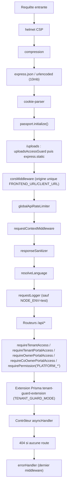

# Conception du système — ImmoTopia

Vue technique de référence pour un agent ou un développeur qui découvre le
dépôt. Complète (sans les remplacer) les documents listés dans
[docs/README.md](../README.md) ; en cas de contradiction avec
`overview.md`, `modules.md` ou `database-schema.md` (datés de 2025-01-27),
c'est ce document et le code qui font foi.

## Pile technique

Versions lues dans les `package.json` du dépôt (racine, `packages/api`,
`apps/web`) le 2026-09-27.

| Domaine         | Techno                               | Version                                                                                                                                                          |
| --------------- | ------------------------------------ | ---------------------------------------------------------------------------------------------------------------------------------------------------------------- |
| Monorepo        | npm workspaces, Node                 | `>=20` (`.nvmrc` : `20`), npm `>=10`                                                                                                                             |
| Backend         | Express                              | `^4.18.2`                                                                                                                                                        |
| Backend         | Prisma (`@prisma/client` + CLI)      | `^5.7.1`                                                                                                                                                         |
| Backend         | TypeScript                           | `^5.3.3`                                                                                                                                                         |
| Backend         | Zod                                  | `^3.22.4`                                                                                                                                                        |
| Backend         | Passport + `passport-google-oauth20` | `^0.7.0` / `^2.0.0`                                                                                                                                              |
| Backend         | jsonwebtoken                         | `^9.0.2`                                                                                                                                                         |
| Backend         | node-cron                            | `^4.2.1`                                                                                                                                                         |
| Backend         | Nodemailer                           | `^6.9.7`                                                                                                                                                         |
| Backend         | Twilio                               | `^5.12.2`                                                                                                                                                        |
| Backend         | docxtemplater / pizzip               | `^3.67.6` / `^3.2.0`                                                                                                                                             |
| Backend         | pdf-lib                              | `^1.17.1`                                                                                                                                                        |
| Backend         | Helmet                               | `^8.1.0`                                                                                                                                                         |
| Backend         | Winston                              | `^3.11.0`                                                                                                                                                        |
| Frontend        | React / React DOM                    | `^18.2.0`                                                                                                                                                        |
| Frontend        | Vite                                 | `^6.0.0`                                                                                                                                                         |
| Frontend        | TypeScript                           | `^5.3.3`                                                                                                                                                         |
| Frontend        | Ant Design                           | `^6.2.0`                                                                                                                                                         |
| Frontend        | React Router                         | `^6.21.1`                                                                                                                                                        |
| Frontend        | @tanstack/react-query                | `5.102.8`                                                                                                                                                        |
| Frontend        | i18next / react-i18next              | `^23.16.8` / `^15.7.4`                                                                                                                                           |
| Frontend        | axios                                | `^1.6.2`                                                                                                                                                         |
| Frontend        | dayjs                                | `^1.11.19`                                                                                                                                                       |
| Frontend        | Vitest                               | `^2.1.8`                                                                                                                                                         |
| Base de données | PostgreSQL                           | `16-alpine` en local (`docker-compose.yml`) ; `>=14` visé en production (à vérifier : aucune contrainte de version dans le code, seulement dans la doc archivée) |

Le frontend est bâti avec Vite (`apps/web/vite.config.ts`), pas Create React
App : plusieurs documents archivés (`docs/setup/getting-started.md`,
`apps/web/env.example`) décrivent encore CRA (`REACT_APP_*`, `npm start`,
dossier `build/`) — le dossier de sortie `build/` a été conservé par le
`vite.config.ts` pour ne pas casser les scripts de déploiement, mais les
variables d'environnement exposées au bundle sont désormais préfixées
`VITE_` (voir « Frontend » plus bas). **À vérifier** : `getting-started.md`
et `apps/web/env.example` n'ont pas été mis à jour depuis la migration vers
Vite.

## Arborescence du monorepo

```text
apps/web                 Frontend React 18 + Vite + Ant Design 6
packages/api              Backend Express 4 + Prisma 5 + PostgreSQL
packages/tsconfig         Configuration TypeScript partagée
packages/eslint-config    Configuration ESLint partagée
docs/                     Documentation
specs/                    Spécifications fonctionnelles par module
.claude/worktrees/        Worktrees git d'agents (voir RUNBOOK.md)
```

### `packages/api/src`

| Dossier                      | Rôle                                                                                                                                                                                                                                                                                                                                                                                                                            |
| ---------------------------- | ------------------------------------------------------------------------------------------------------------------------------------------------------------------------------------------------------------------------------------------------------------------------------------------------------------------------------------------------------------------------------------------------------------------------------- |
| `config/`                    | `env.ts` (validation Zod des variables d'environnement, voir plus bas) et `passport.ts` (stratégie Google OAuth).                                                                                                                                                                                                                                                                                                               |
| `controllers/` (78 fichiers) | Un contrôleur par ressource ; enveloppés dans `asyncHandler`, ne construisent pas eux-mêmes les codes d'erreur HTTP.                                                                                                                                                                                                                                                                                                            |
| `services/` (69 fichiers)    | Logique métier et accès Prisma.                                                                                                                                                                                                                                                                                                                                                                                                 |
| `lib/`                       | Modules transverses organisés par domaine plutôt que par couche : `payment-gateway/` (PaySecureHub), `subscription/`, `syndics/`, `rental/`, `rental-fees/`, `lease-lifecycle/`, `lease-inspections/`, `maintenance/`, `properties/`, `ownership/`, `owner-account/`, `patrimoine/`, `treasury/`, `cash-sessions/`, `accounting-exports/`, `finance/`, `sales/`, `settings/`, `files/`, plus `errors.ts` et `zod-error-map.ts`. |
| `routes/` (52 fichiers)      | Déclaration des routeurs Express, montés dans `app.ts` (voir cycle de vie ci-dessous).                                                                                                                                                                                                                                                                                                                                          |
| `middleware/` (28 fichiers)  | Auth, RBAC, garde tenant, portails, CORS, rate limiting, logging, sanitisation, upload.                                                                                                                                                                                                                                                                                                                                         |
| `jobs/`                      | Tâches planifiées `node-cron`, démarrées dans `index.ts` (liste ci-dessous).                                                                                                                                                                                                                                                                                                                                                    |
| `i18n/`                      | `index.ts` (langue ambiante via `AsyncLocalStorage`, le français est la clé) + `locales/en.json`, `locales/ar.json`.                                                                                                                                                                                                                                                                                                            |
| `templates/`                 | Gabarits de documents générés (`templates/email/…`).                                                                                                                                                                                                                                                                                                                                                                            |
| `constants/`                 | Clés et gabarits par défaut des notifications e-mail/WhatsApp.                                                                                                                                                                                                                                                                                                                                                                  |
| `types/`                     | Types partagés (`express-custom.d.ts` étend `Request`, types par domaine).                                                                                                                                                                                                                                                                                                                                                      |
| `utils/`                     | Utilitaires transverses : `database.ts` (client Prisma étendu), `prisma-tenant-guard-extension.ts`, `property-tenant-guard.ts`, `tenant-ownership.ts`, `tenant-context.ts`, `tenant-access.ts`, `logger.ts`, `email-templates.ts`, etc.                                                                                                                                                                                         |

### `apps/web/src`

| Dossier                   | Rôle                                                                                                                                                                                                                                                                               |
| ------------------------- | ---------------------------------------------------------------------------------------------------------------------------------------------------------------------------------------------------------------------------------------------------------------------------------- |
| `pages/`                  | Écrans, chargés en `React.lazy` depuis `App.tsx` ; sous-dossiers par module (`crm/`, `properties/`, `rental/`, `finance/`, `patrimoine/`, `communication/`, `newsletter/`, `documents/`, `admin/`, `auth/`) plus les portails (`TenantPortal/`, `OwnerPortal/`, `CoOwnerPortal/`). |
| `components/`             | Composants partagés (`shell/AppShell`, `primitives/`, `ProtectedRoute`, `ErrorBoundary`, `TenantRedirect`…).                                                                                                                                                                       |
| `services/` (58 fichiers) | Un module d'appels API par domaine, au-dessus de `utils/api-client`.                                                                                                                                                                                                               |
| `hooks/`                  | `useAuth`, `useBreakpoint`, `useListParams`, `useMenuAccess`, `useScrollRestoration`.                                                                                                                                                                                              |
| `context/`                | `AuthContext`.                                                                                                                                                                                                                                                                     |
| `lib/`                    | `api/`, `query-client.ts`, `query-keys.ts`, `feedback.tsx`, `utils.ts`, `importation/`.                                                                                                                                                                                            |
| `i18n/`                   | `config.ts` (langues, sens d'écriture), `LanguageProvider.tsx`, `t.ts`, `locales/{fr,en,ar}`.                                                                                                                                                                                      |
| `config/`                 | `api.ts` — source unique des URL backend (voir plus bas).                                                                                                                                                                                                                          |
| `theme/`                  | Thème Ant Design.                                                                                                                                                                                                                                                                  |
| `dev/`                    | Atelier de vérification visuelle, **jamais en production** (garde `import.meta.env.DEV` posée sur l'import, vérifiée par la CI, voir RUNBOOK.md).                                                                                                                                  |

## Cycle de vie d'une requête

`packages/api/src/app.ts` construit l'app Express (`index.ts` ne fait que
l'écoute du port et le démarrage des jobs, pour que les tests d'étanchéité
importent l'app sans ouvrir de port). Ordre réel des middlewares :



Points vérifiés dans le code :

- **CORS à origine unique** : `corsMiddleware` (`middleware/cors-middleware.ts`)
  n'autorise que `frontendUrl` (= `CLIENT_URL || FRONTEND_URL`,
  `config/env.ts`). Le middleware `/uploads` fixe explicitement le même
  `Access-Control-Allow-Origin`.
- **`requireTenantAccess`** est exporté par
  `middleware/tenant-middleware.ts` ; les portails ont leurs propres gardes :
  `requireTenantPortalAccess` (locataire), `requireOwnerPortalAccess`
  (propriétaire), `requireCoOwnerPortalAccess` (copropriétaire).
- **Extension Prisma** : `utils/database.ts` applique
  `tenantGuardExtension` (`utils/prisma-tenant-guard-extension.ts`) à chaque
  instanciation du client. La liste des modèles gardés est dérivée de
  `Prisma.dmmf` (tout modèle portant `tenantId`/`tenant_id`), pas maintenue à
  la main. Comportement piloté par `TENANT_GUARD_MODE` (`off` / `warn` /
  `enforce`, défaut `warn`) — voir `env.ts` et AGENTS.md.
- **Ordre de montage des routeurs** : les routes non tenant (webhook
  WhatsApp, IPN PaySecureHub, `/api/auth`, `/api/admin`, `/api/roles`)
  doivent être montées avant tout routeur qui pose `requireTenantAccess` au
  niveau du routeur (syndic, patrimoine, relevés propriétaires…), sous peine
  de rejeter toute requête `/api/*` sans identifiant tenant dans le chemin.
  `app.ts` documente ce risque en commentaire à chaque point sensible — ne
  pas réordonner sans relire ces commentaires.
- **Erreurs** : `errorHandler` (`middleware/error-middleware.ts`) est le
  seul middleware après les routeurs ; les contrôleurs ne posent pas de
  `try/catch` qui devine un statut HTTP (voir AGENTS.md et
  `controllers/property-media-controller.ts` comme modèle).

## Authentification, RBAC, portails

- **JWT** (`jsonwebtoken`) : access token + refresh token
  (`RefreshToken` en base). `JWT_EXPIRES_IN` par défaut `15m` (`env.ts`).
- **Cookies** : `cookie-parser` est monté ; le détail du stockage
  (HTTP-only) est à vérifier dans `controllers`/`routes` d'auth, non relu en
  détail pour ce document.
- **Google OAuth** : `passport` + `passport-google-oauth20`
  (`config/passport.ts`). Optionnel : sans `GOOGLE_CLIENT_ID`/
  `GOOGLE_CLIENT_SECRET`, la stratégie n'est pas enregistrée
  (`isGoogleOAuthEnabled()` renvoie `false`) et le serveur démarre quand
  même — un message de log l'indique, pas une erreur 500 au clic.
  `GOOGLE_CALLBACK_URL` se déduit de `BACKEND_URL` si absente.
- **RBAC** : `middleware/rbac-middleware.ts` expose `requirePermission`,
  `requireAnyPermission` (et une variante « toutes ») ; la clé de permission
  est portée sur le middleware renvoyé (`permissionKey`), ce qui permet à
  `__tests__/unit/routes-inventory.test.ts` de vérifier sans base de données
  que chaque route est gardée par une permission ou un accès tenant/portail.
  Modèles : `Role`, `Permission`, `RolePermission`, `UserRole`,
  `RoleScope` (`PLATFORM` / `TENANT`).
- **Portails** réels (routes `/api/portal/*`, `app.ts`) :
  - `tenant-portal-routes.ts` — portail locataire (`requireTenantPortalAccess`).
  - `owner-portal-routes.ts` + `owner-account-routes.ts`
    (`ownerAccountPortalRouter`) — portail propriétaire, y compris son compte
    courant (`requireOwnerPortalAccess`).
  - `coowner-portal-routes.ts` — portail copropriétaire, lecture seule
    (`requireCoOwnerPortalAccess`).

## Tâches planifiées et intégrations externes

Jobs démarrés dans `index.ts` (sautés si `NODE_ENV=test`), fichiers dans
`packages/api/src/jobs/` :

| Job                                                                   | Fichier                                |
| --------------------------------------------------------------------- | -------------------------------------- |
| Calcul des pénalités de loyer                                         | `penalty-calculation-job.ts`           |
| Réconciliation des paiements en ligne                                 | `online-payment-reconciliation-job.ts` |
| Constatation mensuelle des baux de terrain (le 2 du mois, idempotent) | `land-lease-accrual-job.ts`            |
| Rappels planifiés                                                     | `reminder-scheduler.job.ts`            |
| Campagnes newsletter planifiées                                       | `newsletter-campaign-scheduler.job.ts` |
| Usage des abonnements (échéances, quotas, relances fin d'essai)       | `subscription-usage-job.ts`            |

Intégrations externes réellement présentes :

| Intégration                                                                   | Fichier(s) porteurs                                                                                                                                                                                                                        |
| ----------------------------------------------------------------------------- | ------------------------------------------------------------------------------------------------------------------------------------------------------------------------------------------------------------------------------------------ |
| E-mail (SMTP via Nodemailer)                                                  | `services/email-service.ts`, `utils/email-templates.ts`, `utils/payment-email-templates.ts`                                                                                                                                                |
| WhatsApp (WaSender ou Twilio, sélection par `WHATSAPP_PROVIDER`)              | `services/providers/whatsapp.provider.ts`, `services/whatsapp-notification-send-service.ts`, `services/whatsapp-group-automation-service.ts`, `services/whatsapp-group-broadcast-service.ts`, webhook : `routes/whatsapp.webhook.route.ts` |
| Paiement en ligne des loyers (PaySecureHub, agences)                          | `lib/payment-gateway/paysecurehub/{client,simulator-client,index}.ts`, `lib/payment-gateway/{checkout,config,crypto,settings,status-mapping,types}.ts`, routes publiques : `routes/payment-gateway-public-routes.ts`                       |
| Paiement des factures d'abonnement (PaySecureHub, compte plateforme distinct) | `lib/payment-gateway/platform-account.ts`                                                                                                                                                                                                  |
| Google OAuth                                                                  | `config/passport.ts`                                                                                                                                                                                                                       |
| Génération de documents Word (contrats, quittances, PV d'AG)                  | `services/docx-renderer.ts` (docxtemplater), `lib/syndics/minutes-generator.ts`                                                                                                                                                            |

Le fournisseur WhatsApp est choisi automatiquement (`WHATSAPP_PROVIDER`
vide → `wasender` si `WASENDER_API_KEY` est présent, sinon `twilio`,
d'après `packages/api/env.example`).

## Frontend

- **Routage** : React Router v6 (`App.tsx`), écrans en `React.lazy`
  (`ProtectedRoute` pour les zones authentifiées, `AppShell` lui-même
  lazy-chargé pour ne pas peser sur `/login`).
- **Réseau** : `utils/api-client.ts` (jamais de `fetch` brut dans les
  composants, cf. CONTRIBUTING.md) ; URL centralisées dans
  `config/api.ts` (`API_ORIGIN`, `API_URL`, `fileUrl()` pour résoudre les
  chemins `/uploads/...`).
- **Variables d'environnement frontend** : lues via `import.meta.env`, donc
  préfixées `VITE_` (`VITE_API_ORIGIN`, `VITE_API_URL`), **pas**
  `REACT_APP_*`. `apps/web/env.example` documente encore l'ancienne
  convention CRA — à corriger séparément (hors périmètre de cette passe).
- **React Query** : `@tanstack/react-query` (`lib/query-client.ts`,
  `lib/query-keys.ts`) — cache applicatif introduit pour dédupliquer les
  appels des ~58 modules de `services/`.
- **i18n** : voir [docs/architecture/i18n.md](i18n.md) pour le détail.
  Résumé vérifié : le français est la clé de traduction
  (`apps/web/src/i18n/t.ts`, `packages/api/src/i18n/index.ts`), `t()` est
  appelé hors hook côté web (pour rester utilisable dans les colonnes de
  tableau et les constantes de module), et le sens d'écriture (`dir`) est
  porté par `apps/web/src/i18n/config.ts` (`ltr` pour fr/en). L'arabe
  retourne la mise en page : marges en propriété logique
  (`margin-inline-start`, pas `margin-left`).
- **Ant Design** : thème dans `theme/`, `ConfigProvider` posé dans
  `App.tsx`.

## Fichiers

- **Stockage des uploads** : servi en statique sous `/uploads` par
  `app.ts`, racine résolue par `getUploadsRoot(env.UPLOADS_DIR)`
  (`utils/project-root.ts`) — vide par défaut, alors `<repo>/uploads`.
- **`uploads-access-middleware.ts`** : liste blanche stricte (pas une liste
  noire) devant `express.static`. Seuls sont publics : photos/vidéos de
  biens (`properties/<id>/<file>`), logos d'agence
  (`properties/agency-logos/<tenantId>/<file>`), et les images WhatsApp
  (`whatsapp/**`, nécessaires au fournisseur externe). Tout le reste
  (documents de bien, pièces jointes de maintenance, preuves de paiement,
  documents de syndic, états des lieux) répond 404 à la racine statique et
  ne sort que par une route authentifiée qui vérifie le droit précis de
  l'appelant sur l'objet (`lib/properties/document-files.ts`,
  `lib/maintenance/attachment-files.ts`, `lib/rental/proof-files.ts`,
  `lib/syndics/document-files.ts`). Cette règle est un principe AGENTS.md,
  pas une suggestion.
- **Documents générés** : `docxtemplater` + `pizzip`
  (`services/docx-renderer.ts`) pour les baux, quittances, relevés ;
  `lib/syndics/minutes-generator.ts` pour les procès-verbaux d'assemblée
  générale. `pdf-lib` est également une dépendance backend (usage non
  audité en détail dans cette passe — à vérifier si besoin).

## Pour aller plus loin

- Modèle de données complet : [DATA_MODELS.md](DATA_MODELS.md).
- i18n en détail : [i18n.md](i18n.md).
- Abonnements par packs : [PLAN-ABONNEMENTS.md](PLAN-ABONNEMENTS.md).
- Installation et commandes : [docs/workflows/RUNBOOK.md](../workflows/RUNBOOK.md).
- Dette technique et audit : [AUDIT_CODE.md](../../AUDIT_CODE.md).
